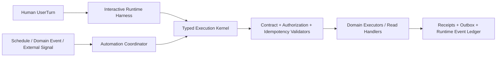

# Agent2 实施前 Principal Architect Review

> 评审日期：2026-07-10  
> 评审范围：Cognitive Core v3 实现、`COGNITIVE_RUNTIME_HARNESS_DESIGN.md`  
> 评审性质：实施就绪度、长期演进能力和过度工程风险审查  
> 变更说明：本评审不修改业务代码，也不修改现有 Harness 设计稿。

## 0. 最终判定

**结论：CONDITIONAL GO，有条件通过。**

Agent2 已经具备演进为企业级 Agent Runtime 所需的**安全主干**：

- 认知与执行已经分离；
- `CognitiveDecisionV3` 拒绝数据库动作、effect 和 write flag；
- Planner 被定义为 action → typed command 的唯一 seam；
- typed daily executor 不接收原始自然语言；
- Conversation State 已有乐观版本控制；
- pending 已绑定用户、会话、action 和 entity；
- Harness 设计把幂等、receipt、replay 和 fail-closed 放在了正确位置。

因此，可以开始：

- 补齐实施前 contract；
- 编写必要 ADR；
- 建立 Shadow-only Runtime tracer；
- 继续复用当前稳定的 typed daily executor。

但现在还不适合：

- 一次性冻结全部 `runtime.v1` contract；
- 让 Harness 接管广泛生产 mutation；
- 宣称 Domain Pack 已经支持企业自动化；
- 接入跨天审批、外部异步 mutation 或通用流程编排。

当前最准确的架构定位是：

> Agent2 已经是“具备企业演进能力的交互式认知 Runtime 基础”，但还不是完整的企业 Runtime，也不是耐久自动化平台。

最大问题不是总体方向错误，而是几个即将固化的 interface 仍围绕“同步的人类文本消息”设计，而目标系统还必须处理：

- 同一会话的并发消息；
- 定时和事件触发；
- 外部回执；
- 跨天审批；
- 多租户数据治理；
- 异步 projection；
- 非 CognitiveDecision 来源的 typed command。

### 分范围 Go / No-Go

| 范围 | 判定 | 原因 |
|---|---|---|
| Contract 修订和 ADR | GO | 不改变线上行为，同时避免未来破坏性迁移 |
| Shadow-only Harness tracer | GO | 可以验证深 module seam，不持有生产写凭据 |
| 复用 typed daily executor | GO | 这是当前最成熟的安全资产，不应重写 |
| Harness 接管小范围交互式日报写入 | CONDITIONAL | 需先完成会话串行化、receipt-driven state 和 tenant 基础 |
| 案件/月报正式 mutation | NO-GO | Domain contract、授权、事件和异步结果语义未闭合 |
| 外部审批或跨天流程 | NO-GO | 缺少 ProcessInstance、Signal、resume 和重新授权协议 |
| 通用自动化平台 | NO-GO | 当前 Domain Pack 没有 trigger/process/wait/signal 能力 |

### Principal 结论

Agent2 **有企业级 Runtime 的架构基础**，但**尚未形成可直接冻结并并行实施的完整 Runtime contract**。

建议允许 v0/experimental tracer 开工，同时先关闭本文 P0 设计门禁；P0 关闭后再发布稳定的 `runtime.v1`。

---

## 1. 评审证据

本次结论基于实际实现，而不是只审设计文档。

关键证据包括：

- Cognitive contract 明确拒绝执行字段：`app/agent2/cognitive_core_v3.py:20-26`；
- action/entity 词表仍硬编码在 Core：`app/agent2/cognitive_core_v3.py:27-34`；
- `RequiredAction.parameters` 和 entity attributes 仍是通用字典：`app/agent2/cognitive_core_v3.py:48-53`、`362-387`；
- LLM prompt 仍固定枚举 action/intent vocabulary：`app/llm/prompts/cognitive_core_v3.md:23-30`；
- 当前 Planner 仍是中央 action switch：`app/agent2/command_planner_v3.py:84-181`；
- typed daily executor 不接收 raw text，并在锁内重读权威日报：`app/agent2/typed_daily_executor.py:41-73`；
- 当前 Orchestrator 在 command execution 前保存 Conversation State：`app/agent2/cognitive_orchestrator_v3.py:43-56`；
- Conversation State 允许多个 pending，但 continuation 当前要求全局只有一个 active pending：`app/agent2/conversation_state.py:83-111`、`app/agent2/cognitive_core_v3.py:534-586`；
- 当前 state key 没有 tenant 维度：`app/models.py:48-65`、`app/agent2/conversation_state_store.py:18-48`；
- scheduler 已存在直接自动修改日报的路径：`app/scheduler/runner.py:64-71`、`app/scheduler/jobs.py:387-432`；
- performance path 仍从 raw text 直接更新 ORM：`app/services/performance_service.py:110-165`；
- 当前 KnowledgeQuery 没有一等 tenant/authorization contract：`app/agent2/knowledge_resolver.py:25-32`；
- 当前案件权限包含 compatibility allow 和硬编码全局身份：`app/agent2/fact_permissions.py:7-10`、`32-39`；
- 当前 outbox 可复用，但还不是企业 Domain Event Envelope：`app/models.py:212-240`。

本轮执行了定向验证：

```text
venv\Scripts\python.exe -m pytest -q \
  tests/test_agent2_cognitive_core_v3.py \
  tests/test_agent2_daily_entrypoint_consistency.py

33 passed
```

这说明当前 Cognitive Core v3 和入口基线是稳定的，但上述测试尚未覆盖：

- 两个不同 message 的同会话并发；
- 外部 receipt 恢复；
- automation trigger；
- 多 pending 的显式选择；
- ProcessInstance；
- 跨租户 Context/Tool cache；
- projection lag 和异步结果真值。

---

## 2. 已经成立的架构基础

### 2.1 CognitiveDecision 已正确失去执行权

这是当前最重要且最正确的设计。

`CognitiveDecisionV3` 只能表达：

- intents；
- entities；
- required actions；
- clarification；
- context update。

它不能表达：

- SQL；
- database operation；
- write flag；
- tool name；
- executor；
- “已经写入”的事实。

这保证了模型即使输出了看似确定的操作措辞，也不会自动获得写权限。该不变量必须永久保留。

### 2.2 Typed command 是正确的强制 seam

当前 typed daily executor 已经展示了目标形态：

- interface 没有 raw message；
- target 和 version 稳定；
- executor 重新检查 owner、状态、版本和 shape；
- aggregate 有锁；
- idempotency 可追踪；
- 结果有结构化 receipt。

Runtime 应加深这条 seam，而不是在旁边再创建 Skill write、Memory write、Tool write 或 automation direct write。

### 2.3 Runtime Harness 是合理的深 module

`handle(RuntimeTurnRequest) -> RuntimeTurnOutcome` 对**交互式 Runtime**而言是一个足够深的外部 interface。

它可以在小 interface 后隐藏：

- ingress 幂等；
- Context Assembly；
- Cognitive Core；
- Skill resolution；
- Planner；
- execution；
- state commit；
- reply；
- delivery；
- trace/replay。

删除 Harness 后，这些复杂度会重新散落到 Stream、Webhook、Manual 和测试。因此 Harness 有真实 leverage，不是多余转发层。

设计也正确地选择“吸收”当前较浅的 `CognitiveOrchestratorV3`，而不是继续套一层 wrapper。

### 2.4 Receipt-driven StateTransition 是正确目标

设计稿提出的 `StateTransitionPlan` 比当前“Core 产出 next state 后立即保存”更可靠。

它能区分：

- 本轮认知已经发生；
- clarification/pending 已创建；
- 业务 command 已成功；
- pending 何时才可以消费。

剩余问题不是方向，而是并发和远程 receipt 语义尚未闭合，见 P0-2。

### 2.5 Tool 与 Domain Executor 的总边界正确

修订后的边界合理：

- Tool Broker：只读或 ephemeral compute，不能改变外部状态；
- Domain Executor：所有持久化 candidate、official mutation 和第三方状态变更。

这是设计中最清晰的部分之一。后续只需要补足可信调用上下文、互斥 Result 类型和异步状态，而不需要推翻边界。

### 2.6 Replay / Evaluation 基础较强

下列方向是可信的：

- 生产与 Replay 使用同一 Harness；
- Runtime Snapshot 固定关键版本；
- Tool tape 不命中时 fail closed；
- 支持 crash injection；
- 分 Semantic/State/Plan/Tool/Execution/Reply/Safety 做 diff；
- Gold case 强制包含六个字段；
- LLM judge 不裁决写权限、target 和 pending。

建议按 slice 实现，不要在第一个 tracer 前一次性建设完整 artifact/version 平台。

---

## 3. 过度抽象风险

总体设计并未普遍过度抽象。风险主要集中在“把未来可能需要的概念提前做成稳定平台”。

### 3.1 过早冻结所有 v1 contract

设计稿 `1276-1279` 希望在 tracer 前固定 Request/Outcome、ContextFrame、Skill Manifest、Command/Tool Result 和 Trace Event。

当前只有 Daily 是真实 typed mutation domain；案件主要是 read，出差停在 candidate，自动化没有 contract。此时冻结全部 v1，等于把推测变成长期兼容义务。

建议：

- 现在冻结安全红线、tenant/identity、idempotency、command provenance 和 receipt truth；
- Context、Skill、Domain Pack 先标记为 `v0/experimental`；
- 用 Daily + 一个真实 read capability 验证；
- 第二个真实变化轴出现后再发布 v1。

### 3.2 Domain Pack 变成万能元平台

当前 Domain Pack 同时声明：

- entity/action；
- context；
- skill；
- command/result；
- event/projection；
- tool/executor；
- authorization policy；
- memory/reply/evaluation/migration。

Skill Manifest 又重复声明其中多项。如果两边都可在运行时解析，会形成双重真值和授权漂移。

应收敛为：

- 独立 versioned contract artifact 是 schema 权威；
- Skill registration 只引用 contract，并声明 capability ceiling；
- Domain Pack 只是 composition/deployment inventory 和 digest；
- 启动时编译一份 immutable `CapabilityCatalogSnapshot`；
- Domain Pack 只能引用 required permission/policy，不得定义可扩权 policy。

现在不要建设远程 Registry、数据库插件加载或热更新 Marketplace。

### 3.3 把不同性质能力都伪装成 Domain Pack

案件生命树和月报绩效是真实业务 domain，拥有 aggregate 和 mutation ownership。

Web search 是 read capability。企业知识库第一阶段是对外部治理系统的 read capability。自动化是 process concern。

可以使用同一个代码内 registration 机制，但不要强迫它们都拥有 aggregate、event、projection、memory 和 migration。

最小区分即可：

```text
domain          拥有 aggregate/command/executor/integration event
read_capability 拥有 read command/tool/result/evaluation
process         引用既有 commands，并拥有 durable process state
```

这是 vocabulary 和校验差异，不是要求建立三个动态平台。

### 3.4 Universal ContextFrame 退化成新的 `dict`

`ContextBundle.frames[]` 对 manifest 和 replay 有价值，但如果完整 Bundle 直接交给所有 consumer，它会成为“看似 typed 的新 resources bag”。

一个 Context Assembly 深 module 足够，内部输出最小视图：

- `DecisionContextView`；
- `PlanningContextView`；
- `ReadHandlerContextView`；
- `ReplyEvidenceView`。

Executor 的授权不能来自通用 Context Bundle。

### 3.5 Memory 变成所有 Runtime 持久化数据的统称

设计把 Runtime journal 和 Skill/Tool Manifest 也称为 Memory，容易形成三份 run authority：

- RunStore；
- Trace Store；
- Episodic Memory。

建议固定术语：

- Agent Memory：Conversation State 和可选的显式用户偏好；
- Runtime Event Ledger：run checkpoint、decision、plan、receipt、outcome、error；
- Capability Catalog：action/command/tool contract 和 policy reference；
- Business Source of Truth：案件、日报、出差、月报、制度和审批。

Trace、Audit、Replay export 和未来的 episodic summary 都应是 Runtime Event Ledger 的 projection，而不是独立权威写路径。

组织 policy 不是用户记忆；用户偏好和组织 policy 也不能共享一个 writer。

### 3.6 把 canonical event 误做成全域 Event Sourcing

“一个事实，多种视图”的方向正确，但不代表所有业务都要改成 event-sourced aggregate。

最小规则应是：

> 权威领域事务通过 transactional outbox 发布 versioned integration event；领域本身可以继续使用现有状态模型。

如果外部案件系统是 Source of Truth，Agent2 应记录 provider receipt 和 integration event，而不是复制一套案件 event store。

### 3.7 按目录图一次性创建大量浅 module

设计稿已经说明目录只是责任地图，应把这条要求写进工程任务：

- 第一阶段只保留 5–7 个深 module；
- 只有生产 + fake/recorded 两种 adapter，或第二个真实变化轴出现时才拆 seam；
- 不要为了测试而把所有内部 helper 暴露成 port。

---

## 4. P0：冻结实施 contract 前必须补齐

### P0-1 交互式 Turn 与耐久自动化必须分开，共享同一执行内核

当前 Harness 的 input 是纯人类消息模型：

- `RuntimeTurnRequest` 要求 actor、conversation、message、text：设计稿 `176-191`；
- `run_key` 绑定 tenant/user/conversation/message：设计稿 `265-281`；
- Outcome 没有 accepted/waiting/cancelled：设计稿 `195-213`；
- Domain Pack 没有 trigger/signal/wait/process contract：设计稿 `1025-1053`。

这无法承载：

- schedule fire；
- domain event；
- approval callback；
- 外部 mutation receipt；
- 跨天工作流；
- service principal；
- delegated/on-behalf-of 权限。

不要把交互式 Harness 扩成通用工作流引擎。推荐两个 orchestrator 共用一个强制执行内核：



现在必须确定的 contract：

- 共享 `InvocationContext`：tenant、invocation ID、trigger type、causation、correlation；
- principal 是 human/service/delegated 的 discriminated union；
- 公共 command envelope 使用 origin union，不能强制每条 command 都有 `decision_id/sub_decision_id`；
- 非人类 trigger 不得伪造成 synthetic user text，也不调用 Cognitive Core；
- Automation Coordinator 只能消费已鉴权、closed-schema 的 typed trigger，并通过 versioned process definition/确定性 planner 生成 typed command；它可以绕过认知解释，但绝不能绕过 command validator、Authorization、idempotency、Domain Executor 和 receipt；
- `RuntimeRun` 保持短生命周期；
- 跨天流程属于 versioned `ProcessInstance`；
- Conversation pending 与企业 approval 是不同 contract。

现在不必实现通用 Process engine，但这些 identity/provenance 字段会从第一天进入持久化 command、trace 和 idempotency key，不能后补。

而且自动化并非纯未来需求：scheduler 当前已直接自动提交日报（`app/scheduler/runner.py:64-71`、`app/scheduler/jobs.py:387-432`）。因此 write-path inventory 必须覆盖 scheduler、API 和 legacy service，而不只是三个消息入口。

### P0-2 修复会话并发和副作用后的 State 语义

同 message 幂等不能串行两个不同 message。

两个 worker 可以同时：

1. 读取相同 Conversation State version；
2. 分别产生 plan；
3. 执行不同或相同副作用；
4. 最后只有一个 state CAS 成功。

项目已有 `CONCURRENCY_REVIEW.md` 明确记录同一用户并发消息风险。

Harness 设计正确地把 State commit 推迟到 receipt 后，但失败表仍写着 State CAS conflict 可以“零写退出”。如果远程 mutation 已成功，这不可能成立。

需要固定以下协议：

1. 可能改变 L1 state 的 Turn，在读取 state 前获取 conversation execution lease/fencing token。
2. mutation 前持久化 plan 和 conditional state reducer。
3. 同数据库 mutation：aggregate write、command receipt、满足条件的 state operations、run checkpoint、audit outbox 同一 UoW。
4. 远程 mutation：先持久化 `DispatchIntent` 和待应用 reducer，再以 provider idempotency dispatch。
5. provider receipt 到达后按 operation ID 幂等应用 state reducer。
6. 副作用后的 CAS conflict 不得重新执行 command，只能基于已有 receipt 合并或 reconciliation。
7. lease/fencing 失效时，尚未开始的 mutation 必须 block。

Run 幂等和 conversation sequencing 是两个不同问题，需要两个不同 key/lease。

### P0-3 多 pending 语义必须与多意图一致

设计稿的 Decision Context 写“唯一 pending”，但当前 State 是 `tuple[BoundPending, ...]`，多意图天然可能产生多个 pending。

当前 continuation 甚至在显式 `pending_id` 命中时，也因 `len(active) != 1` 而拒绝，只要存在第二个无关 pending（`app/agent2/cognitive_core_v3.py:551-556`）。这是单 pending 假设。

需要固定：

- Context Assembly 传递有上限的 active pending headers，不私自选一条；
- 可信 reply-to/pending ref 可以确定性预绑定；
- 显式 `pending_id` 可在存在其他 pending 时继续唯一匹配项；
- 多个候选且用户只说“是的/确认/对”时，必须 clarification、零写；
- pending 记录 action contract/schema version；
- 跨用户、跨天 approval 不进入 Conversation pending。

### P0-4 Domain Pack 必须真的能扩展 Cognitive Core

当前每接一个新 action，仍需修改：

- Core 的 `_ACTION_ENTITY_TYPES`；
- 固定 prompt vocabulary；
- 中央 Planner switch。

如果不改变这一点，Domain Pack 只是元数据包装，不是真正扩展 seam。

需要固定：

- `RequiredAction` 携带 `action_contract_ref` 或 schema major；
- entity/action body 采用递归 closed schema；
- Interpreter 获得的是由 catalog 生成的机器可读 contract 摘要，Domain Pack 不能注入任意 prompt 文本；
- Core 使用同一 `CapabilityCatalogSnapshot` 验证 action/entity binding；
- Planner 解析该 contract 已注册的 deterministic compiler；
- CognitiveDecision contract version 与 action contract version 分离；
- 未知、重复 owner 或 disabled contract 一律 fail closed。

这是真实 seam，因为 Daily 和至少一个未来 read capability 已经形成两个使用方；但不需要动态 Marketplace。

### P0-5 在第一次 mutation plan 前预留有界 Reference Resolution

设计正确地禁止 ToolResult 改写已持久化 mutation plan。但用户通常说的是“海花岛案”，不是 stable `case_id + version`。

如果所有 Tool 都在最终 `planned` checkpoint 后执行，就算授权查询唯一命中，也只能强制用户两轮操作。

现在应预留以下受控阶段：

```text
Cognitive action + typed entity hint
  → typed ReferenceResolution plan
  → BoundRef | Ambiguous | NotFound
  → 第一次且唯一的 mutation plan
  → validation
  → planned checkpoint
  → execution
```

约束：

- resolver 只接 typed entity hint，不接完整 raw conversation；
- resolver 只读、受权、可 replay；
- 唯一结果包含 stable ID、version、provenance、authorization scope；
- 多命中或未命中必须 clarification；
- execution 阶段依然禁止 plan expansion；
- 不引入模型自主 Tool loop。

Daily tracer 可以暂不实现 resolver，但 RunStore/trace schema 不要永久假设只有一个 pre-execution `planned` stage。

### P0-6 Context / Tool / Handler 的安全 interface 尚未闭合

#### Context Provider 与 Tool 的读取所有权

必须固定：

- Context Provider 只按已绑定 stable ref 水合确定性 snapshot；
- Tool 执行用户驱动的搜索、发现和 ephemeral compute；
- 两者复用同一个 domain-owned Read Module，不能各写一套 SQL、ACL、cache 和 freshness；
- ContextAssembler 只负责 requirement、budget、裁剪、脱敏和 packaging，不拥有领域查询语义。

#### Consumer-specific ContextView

`ContextFrame` 至少需要：

- tenant ID 和 effective authorization scope hash；
- data classification；
- source version/etag；
- `derived_from` 和 transformation version；
- fact authority；
- `content_role=data`；
- `instruction_capability=none`。

“authoritative”只能表示事实来源权威，绝不能表示内容可充当 control-plane instruction。该规则同样适用于内部制度和案件材料，而不只是 Web 页面。

每个 consumer 只能获得 manifest 允许的最小 typed ContextView。完整 Bundle 用于 assembly/audit，不应原样交给 Core、Planner、handler 和 Reply Composer。

#### Command → Handler → Tool 拓扑

需要一个确定性 read-command handler：

```text
ReadCommandHandler.handle(validated_read_command, execution_context, tool_broker)
  -> ReadCommandResult
```

Planner 产生 command；read handler 将其转换为预声明的 Tool calls；Tool Broker 只认识外部 read capability，不认识业务 action；执行阶段不允许 LLM 选择 tool name。

#### Trusted Tool invocation

当前 `TypedToolCall` 缺少 Tool Broker 声称要校验的多项可信字段。

Broker 应接收不可伪造的 `ValidatedToolInvocation` 或 capability grant，至少绑定：

- tenant；
- human/service/effective principal；
- purpose；
- Skill/contract version；
- plan digest；
- resource scope；
- data policy；
- deadline；
- atomic budget reservation。

`effect_class` 必须从 versioned contract 派生并与 envelope 比对，不能信任 caller 自称 `read_only`。

### P0-7 拆分 Result 类型并定义异步真值

设计稿共用的 ToolResult/CommandResult 示例混淆了 read 和 mutation，也没有 `accepted/awaiting_receipt`。

建议拆成互斥 closed contracts：

```text
ToolResult
  status: succeeded | failed | timed_out
  evidence/artifact/provenance/cost
  # 类型层面不存在 actual_write、mutation receipt、aggregate version

DomainCommandResult
  status: succeeded | blocked | failed | accepted | awaiting_receipt
          | timed_out | indeterminate | cancelled
  business receipt / outbox receipt / aggregate versions / actual_write
```

规则：

- outbox enqueue 成功只代表 accepted，不代表业务成功；
- provider completion 是后续 typed receipt/signal；
- Reply Composer 可以说“已受理，等待回执”，不能说“已完成”；
- canonical mutation 与每个 projection 拥有独立完成状态；
- `indeterminate` 只表示副作用未知，不表示正常异步等待。

### P0-8 只保留一份 Runtime Ledger，并在 v1 前定义数据治理 envelope

RunStore、Trace Store 和 Episodic Journal 当前职责重叠。

应只有一份 append-only Runtime Event Ledger 作为恢复权威，并与 run checkpoint 同事务提交。Trace view、audit、replay bundle 和未来 episodic summary 都是 projection。

任何敏感 payload/artifact ref 在进入生产历史前，至少要携带：

- tenant ID；
- data classification；
- retention class/expiry；
- encryption key ID；
- residency/region policy；
- legal-hold state；
- access/export/delete policy ref；
- payload hash；
- redaction policy version。

密钥管理 UI、legal-hold 控制台和通用 artifact 平台可以后做；如果这些字段不进入 v1，未来必须迁移所有历史 trace/replay 数据。

---

## 5. P1：广泛 Live 或远程 mutation 前完成

这些不是 Shadow tracer 的 blocker，但应成为多租户 Live 和外部 mutation 的硬门禁。

### P1-1 Tenant migration 和 fail-closed Authorization

设计稿已把 tenant-aware state migration 放在 Phase 2，这是正确的，但必须提升为所有新 Domain live 的硬门禁。

Tenant scope 必须存在于：

- invocation/run/process；
- state/pending；
- command/idempotency key；
- target/event/projection/outbox；
- Tool call/result/cache；
- Context/evidence；
- delivery/audit/replay artifact。

当前 `fact_permissions.py` 的 compatibility allow 和硬编码全局身份不能进入企业案件/知识 capability。授权上下文缺失必须 fail closed。

### P1-2 Runtime Operations

Runtime trace 不等于运行就绪。广泛 Live 前需要内部支持：

- tenant/global concurrency quota；
- admission control 和 bounded queue；
- cancellation/deadline propagation；
- graceful shutdown 和 lease handoff；
- 按 tenant/domain/effect class 的 mutation kill switch；
- stuck run / awaiting receipt reconciliation；
- outbox/inbox backlog、dead letter、poison event 告警；
- PII-safe metrics 和 SLO。

这些能力应隐藏在 Runtime implementation 和 operations adapter 内，不需要扩大外部 Harness interface。

### P1-3 Model Data Handling Policy

用户有权读取某项事实，不等于可以把该事实发送给任意模型 provider。

Context policy 还需绑定：

- data classification 允许使用的 provider/model；
- residency 和 provider retention mode；
- redaction/tokenization 要求；
- confidential text 是否允许离开企业边界；
- prompt/model revision。

所有 retrieval 内容都只是 data，不是 instruction，无论来源是 Web、企业制度还是案件系统。

### P1-4 Inbox、回调鉴权和 reconciliation

Outbox 只解决了异步可靠性的一半。外部 receipt 和 automation signal 还需要：

- signed source verification；
- provider event ID 幂等；
- 处理前写 Inbox；
- duplicate/late/out-of-order 策略；
- cancel/success race；
- retry 和 manual recovery。

第一个审批、日历写入或远程案件 mutation 上线前必须完成。

### P1-5 Production write-path inventory

仓库仍存在 scheduler、performance、ReportService、legacy executor、debug/admin 等多个直接 writer。

在宣称“不允许绕过 typed command”前，应形成明确台账：

```text
writer → target aggregate → 生产可达性 → 迁移 Phase
       → typed command replacement → retirement/exception owner
```

测试 fixture 和隔离 debug 可以作为显式例外，但不能让生产 writer 隐含存在。

---

## 6. Context / Memory / Skill / Tool 边界结论

| 领域 | 判定 | 正确所有权 | 必须修正 |
|---|---|---|---|
| Context Assembly | 有条件通过 | 按阶段选择、budget、provenance、redaction | Provider 只做 stable-ref hydration；补 classification/lineage；输出最小 ContextView |
| Conversation State | 有条件通过 | 当前会话 goal、entity ref、constraints、pending | tenant/schema version；多 pending；state-changing turn 串行化 |
| Runtime Journal | 需重新命名 | run recovery 和 audit facts | 收敛为唯一 Runtime Event Ledger，不再同时存在 Memory/Trace/Run authority |
| User Preference | 暂缓 | 仅显式授权的用户偏好 | 与组织 policy 分离；写入仍走标准 typed Domain Executor |
| Capability / Skill Registry | 有条件通过 | action contract → compiler/capability | 编译唯一 Catalog；Domain Pack 不做第二真值；单独明确 command handler lookup |
| Tool Broker | 方向强、interface 未闭合 | 外部只读和 ephemeral compute | capability grant；effect 由 contract 派生；ToolResult 与 mutation result 分离 |
| Domain Executor | 方向强 | 所有持久化/远程 mutation | async accepted/receipt；执行时权威重验；fencing/idempotency |
| Reply Composer | 通过但依赖 receipt | 用户可见事实声明 | 区分 accepted、committed、projected，不根据 plan 文本声明成功 |

### 执行时权威重验不变量

Planning snapshot 只能用于 targeting 和 explanation，不能单独授权写入。

真正 mutation 前，owning Domain Executor 必须：

- 重读或锁定权威 aggregate；
- 重验 tenant/actor authorization；
- 重验 target state 和 expected version；
- 重验 fencing/idempotency token；
- 只消费 closed typed body。

当前 typed daily executor 已体现这个模式，应继续作为 reference implementation。

---

## 7. Domain Pack 对未来能力的真实支持度

### 7.1 案件生命树：有条件支持

设计中的稳定 case target、expected version、domain-owned event 和 projection 方向正确。

正式 mutation 前仍需：

- aggregate invariant 和允许的 stage-transition graph；
- effective time 与 recorded time；
- correction/retraction，而不是静默改历史；
- evidence hash/version 和 legal hold；
- ethical wall、matter-level、field-level authorization；
- approval request 与 approval completion 分离；
- case fact 与 view directive 分离。

“记到日报”是用户的视图要求，不一定是 `CaseEvent` 的领域字段。案件事务可以同时发布事实和 projection request，但 Daily 条目必须记录：

- `source_event_id/source_version`；
- 用户本地 override；
- 上游纠正/撤回规则；
- Daily 展示修改是否与案件事实脱钩。

结论：目标 Runtime 能支持案件生命树，但当前 Domain Pack schema 不能直接支撑正式案件写入。

### 7.2 企业知识库：支持只读接入，不包含知识库治理

Typed search、文档 ACL、freshness 和 citation 与 Read Handler/Tool 设计匹配。

第一阶段应明确为“查询一个已经受治理的知识系统”，不包含：

- 文档上传和发布；
- 审核流程；
- 索引重建编排；
- ACL 管理；
- 删除/归档治理。

这些未来应属于独立 Knowledge Management domain。

Read contract 还需记录：

- document/index/ACL version；
- chunk provenance；
- authorization-scope cache key；
- ACL 变化后的 cache invalidation。

结论：完成 tenant/authorization 和 Context/Tool 修正后，可以作为 read capability 接入。

### 7.3 月报绩效：有条件支持

把月报定义为视图，同时把 draft/submission 定义为独立 versioned aggregate，是正确方向。

可重现的月报提交必须绑定：

- reporting period 和 timezone；
- daily/case projection version 和 watermark；
- metric-definition version；
- performance-policy version；
- generated-at/cutoff timestamp；
- report aggregate version；
- close/reopen/manager-review status。

否则上游 projection 或指标定义变化后，无法重建当时提交依据。

当前 `PerformanceTaskService.submit_text` 仍是过渡路径，Runtime 正式接管前必须迁入 typed command。

结论：增加 snapshot/watermark 语义后，目标架构可以支持。

### 7.4 Web search：支持，但它不是业务 Domain

Web search 适合：

- versioned Tool contract；
- egress DLP；
- source provenance；
- capture time；
- untrusted content；
- cost budget；
- replay tape。

它不需要 aggregate、event store、projection 或 Memory policy。预先规划的 search/fetch command graph 足够，不需要 autonomous Tool loop。

结论：架构支持，应作为 read capability；不应强行包装成完整业务 Domain Pack。

### 7.5 自动化流程：当前不支持

Domain Pack 可以暴露自动化将来会调用的 commands/events，但当前没有：

- schedule/domain-event/signal invocation；
- service/delegated principal；
- durable ProcessInstance；
- wait/timer/resume；
- human work item/approval；
- callback Inbox 和 signature verification；
- cancellation/reconciliation/compensation；
- process-definition version pinning。

最小未来 contract：

```text
ProcessInstance
  tenant_id
  process_id / definition_version
  subject_refs
  initiator_principal / effective-principal policy
  status: running | waiting | completed | cancelled | failed | manual_recovery
  current_step / waiting_on / wake_at
  command_refs / receipt_refs
  correlation_key / version

ProcessSignal
  signal_id / provider_event_id
  tenant_id / process_id / step_id
  signal_type / payload_contract
  signed_source_ref / acting_principal
  occurred_at / idempotency_key
```

现在不要实现通用 DAG/BPM。等选定第一个真实审批或定时流程后，实现一条窄的 durable process；第二个差异显著的流程出现后再决定是否抽象。

但 Process/Signal 的 identity、version 和 command provenance 必须在 Runtime v1 前预留。

---

## 8. Canonical Event / Projection 评审

“一个业务事实，多种业务视图”原则正确，但还缺可实施 contract。

必须区分：

1. Runtime Trace Event：记录 Runtime 做了什么；
2. Domain Integration Event：记录已提交的业务事实或权威外部 receipt；
3. Projection Receipt：记录某个 view 如何处理该事件；
4. View Directive：记录用户显式要求事实出现在哪个 view。

它们不能共用一个 generic event schema。

Domain Event Envelope 至少应预留：

```text
event_id / event_type / event_contract_version
tenant_id / owning_domain
aggregate_type / aggregate_id / aggregate_version
occurred_at / effective_at / recorded_at
actor_or_service_principal / authorization_ref
source_command_id / source_receipt_id
causation_id / correlation_id
payload_ref / payload_hash / data_classification
idempotency_key
```

Projection 规则：

- projection 只能写 read model；
- planning 必须记录读到的 read-model version/watermark；
- projector result 区分 queued/applied/failed；
- 新 projection version 先 shadow rebuild、追平 watermark，再原子切换；
- correction/retraction 是新事实，不是静默修改不可变历史；
- 敏感数据通过受治理 artifact ref 保存，不把正文永久写进 event row。

当前 prompt 中“一项工作同时形成 domain view 和 Daily action”的描述（`app/llm/prompts/cognitive_core_v3.md:27`）仍是过渡语义。案件/出差正式写入前，应把“业务事实”与“requested views”拆开，避免 Planner 生成两个 authoritative writes。

---

## 9. 现在明确不要做什么

以下工作不能解决当前真正风险，反而会把系统推向过度工程：

1. 通用 DAG、BPMN 或万能 workflow engine。
2. 动态 Skill Marketplace、远程 Registry、数据库 executable plugin。
3. 通用 Saga/自动补偿平台。
4. 把所有业务领域改成 Event Sourcing。
5. 第二个真实 event version 出现前建设通用 upcaster/projection 平台。
6. 向量化长期会话记忆、自动用户画像、自动生成永久偏好。
7. LLM 自主 Tool loop 或动态 tool name。
8. 统一所有领域的全球 entity ontology。
9. 允许 Domain Pack 自带可扩权 authorization DSL。
10. 每个 Context slot 都单独建立 port/provider 文件。
11. 在 Daily + 一个 read capability 验证 Runtime 前，同时开发全部未来 Domain。
12. 为了目录更整齐重写稳定 typed daily executor。
13. 立即建设完整 artifact governance 管理后台；现在只需固定 envelope 字段。
14. 以自然语言回复逐字相等作为主要 evaluation gate。

近期真正需要投入的是：

- identity；
- concurrency；
- result lifecycle；
- catalog ownership；
- information flow；
- data governance；
- async receipt truth。

---

## 10. 现在不定，未来必然返工的设计

| 必须现在决定 | 延后为何会形成破坏性返工 |
|---|---|
| Human/service/delegated invocation 和 command origin | 否则所有持久化 command/trace 都默认源自 CognitiveDecision |
| RuntimeRun 与长期 ProcessInstance 的区别 | per-message lease 无法表达跨天审批 |
| `accepted/awaiting_receipt` 与 `succeeded` 的区别 | 远程 mutation 和 projection 会产生 false success |
| conversation sequencing/fencing | 副作用后的 State CAS conflict 不可能按“零写”处理 |
| 多 pending 显式选择语义 | 多意图 confirmation 会继续被全局唯一 pending 限制 |
| action/entity schema version 和 Capability Catalog | 每个新 Domain 都要同时修改 prompt、Core、Planner |
| mutation 前的 bounded reference resolution | 名称型案件操作只能永久两轮，或被迫不安全扩 plan |
| Context Provider 与 Tool 所有权 | ACL、cache、query logic 会出现两套实现 |
| consumer-specific ContextView | universal bundle 会成为新的敏感数据泄漏面 |
| Tool capability grant 和 contract-derived effect | Broker 无法独立阻止伪装成 read-only 的调用 |
| 唯一 Runtime Event Ledger | recovery、audit、replay 会在三份 store 中漂移 |
| Artifact tenant/classification/retention/key metadata | 历史 trace/replay 后续难以治理、删除或迁移 |
| Domain Event 与 Runtime Trace Event 分离 | 业务 projection 无法安全建立在审计 schema 上 |
| canonical fact 与 view directive 分离 | 案件、日报、月报会在纠正时重复或漂移 |
| 每个持久化 key/ref 的 tenant scope | 跨租户隔离无法局部补丁式修复 |

---

## 11. 实施前需要形成的 ADR

本评审不修改 Harness 设计稿。建议增加以下简短 ADR 或统一 addendum：

1. **ADR-01：Interactive Harness 与 Automation Coordinator**  
   固定共享 InvocationContext 和 Typed Execution Kernel；非人类 trigger 不进入 Cognitive Core。

2. **ADR-02：Run、Operation、Process、Delivery 生命周期**  
   固定 synchronous、accepted、awaiting receipt、completed、cancelled、indeterminate。

3. **ADR-03：Conversation sequencing 与 receipt-driven StateTransition**  
   固定 conversation fencing、同库 UoW、远程 receipt reducer。

4. **ADR-04：Versioned Cognitive Action Catalog**  
   固定 closed action/entity contract、catalog snapshot、prompt summary、compiler/handler resolution。

5. **ADR-05：Bounded Reference Resolution**  
   固定第一次 mutation plan 之前的可选只读 resolution stage。

6. **ADR-06：Context 与 Tool information-flow security**  
   固定 Provider/Tool 所有权、ContextView、classification、capability grant、互斥 Result。

7. **ADR-07：Runtime Event Ledger 与 Artifact Governance**  
   固定唯一恢复权威和 payload retention/encryption metadata。

8. **ADR-08：Domain Integration Event 与 Projection**  
   分离业务事实、Runtime trace、projection receipt、view directive；明确不强制 Event Sourcing。

9. **ADR-09：Pending 与 Approval**  
   固定多 pending 选择、contract version，以及与跨用户/跨天审批的分离。

这些是九项设计决定，不是九个需要立即建设的新平台。

---

## 12. 推荐实施门禁顺序

### Gate A：Contract Correction

- 关闭本文 P0 决策；
- 暂用 experimental schema；
- 建立 production write-path inventory；
- 增加 catalog referential-integrity 和 forbidden effect 架构测试。

### Gate B：Shadow Tracer

- 实现交互式 Harness 深 seam；
- 复用当前 Core、Planner、typed daily simulate adapter；
- 只写一份 Runtime Event Ledger；
- 物理移除 official mutation credential；
- 用 Replay 比较 current/candidate。

### Gate C：Runtime Transaction Foundation

- tenant-aware state/key；
- conversation sequencing/fencing；
- durable plan 和 conditional state reducer；
- same-DB UoW 和 outbox/inbox；
- outcome/delivery idempotency；
- artifact governance metadata。

### Gate D：Daily Live Cohort

- 只接选定交互式 Daily command；
- 保留当前 typed executor；
- 覆盖两个不同并发 message、写后 crash、reply 丢失、重复 ingress、state conflict；
- 在宣称 Daily 无旁路 writer 前，把 scheduler auto-submit 迁入 typed trigger/command。

### Gate E：一个真实 Read Capability

- 选择企业知识或案件查询；
- 验证 authorization、ContextView、deterministic read handler、Tool grant、citation、replay tape；
- 本 Gate 后再发布稳定的 Context/Skill/Tool v1。

### Gate F：第一个 Cross-view Domain Mutation

- Case 或 Monthly 二选一，不要并行同时开；
- 引入 integration event、view directive、projection receipt；
- 验证 correction、projection lag、replay。

### Gate G：第一个 Durable Process

- 选择一条真实 schedule 或 approval；
- 实现窄的 ProcessInstance/Signal；
- 第二个差异显著流程出现前不抽通用 DAG/BPM。

---

## 13. 本评审新增的最小 Harness 验收用例

以下用例应继续包含既定六项 Gold 断言，并增加对应 Runtime 断言。

### Concurrency / State

- 同一 conversation 的两个不同 message 并发到达；
- 只有持有有效 fencing token 的 Turn 可以开始 mutation；
- remote receipt 在 conversation 已推进后到达；
- state reducer 使用 receipt identity，不能重跑 command；
- lease 过期后的旧 worker checkpoint 被拒绝。

### Pending / Approval

- 两个 active pending + 显式 `pending_id`，只继续一项；
- 两个 active pending + “确认”，clarification 且零写；
- 另一 actor 的 approval 不能被当成 conversation confirmation；
- 相同 approval signal 重复投递只应用一次。

### Catalog Extensibility

- 增加 fixture action contract/compiler，不修改 Core、Harness、transport；
- 未知 schema major fail closed；
- duplicate action owner 或 dangling handler 在启动时失败；
- Domain Pack permission declaration 不能扩大中心 AuthorizationSnapshot。

### Context / Tool Security

- Context Provider 拒绝 semantic search，只水合 stable ref；
- ToolResult 无法反序列化 mutation receipt；
- mutation-capable adapter 即使自称 read-only 也被 contract metadata 拒绝；
- Core 看不到其 ContextView 之外的 frame；
- 内部文档 prompt injection 只能作为 data；
- tenant/scope 不同的 evidence cache key 必须不同。

### Automation / Async Execution

- 相同 schedule fire 重复投递，只生成一个 command；
- service principal 与 delegated principal scope 不同；
- outbox enqueue 结果是 accepted，不是 succeeded；
- provider callback 只把 awaiting receipt 完成一次；
- signature failure、late callback、cancel/success race 安全失败；
- waiting 期间权限撤销，下一次 mutation 前重新授权。

### Domain Event / View

- canonical business commit 成功而 projection 仍 queued；
- projection receipt 前 reply 不宣称 view 已更新；
- projection 按 event/projection/version 幂等 replay；
- correction/retraction 产生可解释的 view 更新；
- 用户修改 Daily 展示不能反写上游 Case fact。

---

## 14. Principal Architect 最终结论

Agent2 已经不再只是“日报 Agent 打补丁”。Cognitive Core v3、typed execution、pending binding 和 Harness 方向共同形成了可信的企业 Runtime 基础。

但当前 Harness 仍主要为同步人类消息优化。最大的未闭合问题是：

- durable invocation/resume；
- conversation sequencing；
- origin-neutral command contract；
- Catalog-driven Core extensibility；
- bounded entity resolution；
- Context/Tool information-flow security；
- asynchronous result truth；
- tenant/data governance。

因此最终裁决是：

- **总体架构方向：通过。**
- **企业演进基础：具备。**
- **全部 contract v1 冻结：暂不通过。**
- **Shadow 实施：在 P0 addendum 开始后允许。**
- **广泛 Live mutation 和 automation：在对应门禁完成前阻断。**

如果先关闭 P0，同时坚决不建设本文明确延后的通用平台，Agent2 将拥有一条务实、最小且可验证的演进路径：从稳定日报执行切片，逐步扩展到案件生命树、企业知识问答、月报绩效、Web research 和耐久自动化，而不会重新退化成日报中心或产生第二条绕过 typed command 的执行链。
