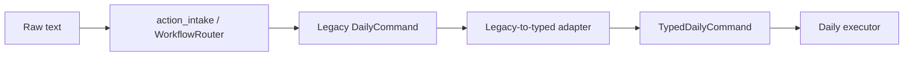
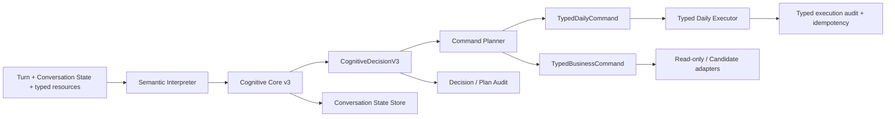

# Agent2 Cognitive Core v3

## 目标与非目标

Cognitive Core v3 把 Agent2 的中心从“日报 action router”移到企业业务入口的认知链路。日报、案件、出差、查询和聊天是同一条认知结果的不同业务动作，日报不再承担跨业务会话状态。

本阶段保留现有 typed daily command、validator、幂等键、版本校验、audit 和执行器能力。不在本阶段建设案件或出差正式写库 executor；案件查询是只读 command，出差是 candidate command。

## 当前链路与 v3 链路

旧链路仍用于关闭 v3 开关时的日报兼容：



旧 `CognitiveDecision v2` 是上述链路完成后的观察对象，包含 `allow_write`、effects 和 daily commands，因此不是认知层的独立 interface。

v3 链路：



关键 seam：

- `CognitiveCoreV3.process(turn, state) -> decision + next_state`：纯认知，无 I/O、无写权限。
- `CognitiveCommandPlanner.plan(decision, context) -> typed command plan`：唯一认知到命令的翻译位置，不读取自然语言。
- `execute_typed_agent2_daily_commands(..., commands, execution_context)`：只接收 typed commands；没有 `raw_input`、LLM output 或非结构化 action 参数。
- `ConversationStateStore.load/save`：PostgreSQL 与内存两个 adapter，共享乐观版本 interface。

## CognitiveDecision v3

```json
{
  "decision_id": "uuid",
  "intents": ["daily_append", "case_query"],
  "entities": [],
  "confidence": 0.0,
  "required_actions": [],
  "clarification_need": null,
  "context_update": {},
  "source_text_hash": "sha256",
  "contract_version": "cognitive_core.v3"
}
```

禁止字段包括：

- `allow_write`
- `should_write_db`
- `effects`
- `commands`
- `database_operation`

这些字段出现在模型输出时，`SemanticInterpretation` 直接拒绝该结果。CognitiveDecision 不声明“已经写入”，也不授权数据库操作。

## Conversation State

`ConversationState` 包含：

- `current_goal`：当前主目标及其实体引用。
- `current_entities`：案件、人员、客户、日期、日报事件等已确认业务对象。
- `recent_context`：带稳定 context ID、message ID、intent、entity ID 和时间的最近上下文。
- `pending`：强绑定 pending。
- `user_constraints`：`no_daily_write`、`read_only`、`no_history_mutation`、`draft_only`。
- `version`：跨进程乐观并发版本。

状态存储在独立的 `agent2_conversation_states` 表，不写入 `daily_reports.section_status`。三个生产入口使用同一 PostgreSQL adapter；测试使用内存 adapter。

### Pending 不变量

每个 pending 必须同时包含：

- `pending_id`
- `user_id` 与 `conversation_id`
- `intent`
- `action`
- 至少一个 `entity_id`
- `context_id`
- `created_at` 与 `expires_at`

`continue_pending` 必须按 pending ID 精确命中，并同时匹配 intent、action、entity IDs。任一不匹配、过期或非唯一时，Core 删除该 action 并返回 `pending_binding_mismatch` 澄清。旧 pending 不会自动抢占新指令。

## Command Planner

Planner 只消费 CognitiveDecision 和结构化资源。目前支持：

- `capture_daily_event` → `append_item`
- `edit_daily_item` → `edit_item`
- `delete_daily_item` → `delete_item`
- `merge_daily_items` → `merge_items`
- `submit_daily_report` → `submit_report`
- `answer_case_query` → `query_case_risk`，只读
- `record_travel_event` → `record_travel_candidate`，候选态

日报编辑、删除、合并必须使用 `turn.resources.daily_draft.items` 中的稳定 item ID。目标数不符、目标不存在、版本冲突或用户约束禁止时，Planner/validator fail-closed。

### 日报动作策略

- 追加内容、明确单条编辑、明确单条删除、明确多条合并、唯一 active draft 提交均属于低风险常规动作；目标和版本有效时直接规划并执行，不创建 confirmation pending。
- “那条删掉”“这几条合并”等无法解析出唯一稳定 item ID 的请求只返回 `clarify_target`，零写；confirmation 不能替代目标解析。
- “确认”“是的”“对”只允许继续同用户、同会话、未过期且唯一的强绑定 pending；没有或存在多个 pending 时只澄清，不能推断成日报提交。
- 清空整份、覆盖整份、跨日期批量变更、修改已提交或已锁定数据等高影响动作，必须先解析精确目标和版本，再按需创建绑定 pending。

## 生产入口策略

Stream、Webhook、Manual 均已具备 v3 seam：

1. 加载同一 Conversation State。
2. 调用语义 adapter 和 Cognitive Core。
3. 生成 typed command plan。
4. 日报 typed command 进入新 typed executor。
5. 案件查询、聊天及候选反馈暂时复用现有只读展示 adapter。
6. v3 语义失败时零写并提示重试，不回退到规则写路径。

`agent2_cognitive_core_v3_enabled` 默认关闭，便于先建表、回放和灰度。关闭时现有日报链路保持不变；开启后 v3 是唯一的新写命令来源。

服务器部署通过 `.env` 显式开启该开关；代码默认值仍为关闭，以保证新环境在建表和 smoke 前 fail-safe。当前服务器语义模型由环境配置为 `deepseek-v4-flash`，schema adapter 最多做两次结构修复；修复仍不满足契约时零写，不回退到 legacy 写路径。

## 场景覆盖

`tests/test_agent2_cognitive_core_v3.py` 覆盖：

1. 聊天中插入日报，日报事件被捕获且聊天 goal 不被切断。
2. 日报内容与案件问题拆成 daily typed command 和只读 case command。
3. 连续案件讨论后，通过显式 context reference 把正确上下文追加到日报。
4. 单句拆出 travel candidate、daily event 和 case query。
5. 月报 pending 存在时，显式日报提交不被劫持。
6. pending 完整绑定、错误 pending continuation fail-closed。
7. 用户“不写日报/只读”等约束持久化并阻断 Planner。
8. 明确编辑、删除、合并只使用稳定 item ID。
9. 模型执行字段拒绝、状态序列化、三入口 typed-executor seam。

### Harness 分层

- Gold：`evals/agent2/golden/daily_typed_p0.jsonl` 与 `tests/test_agent2_daily_p0_harness.py`；每例断言 `intent`、`action`、`fields`、`should_write_db`、`expected_reply_type` 和 `forbidden_behavior`。
- Cognitive v3 场景：`tests/test_agent2_cognitive_core_v3.py`；断言多 intent、实体绑定、context reference、pending、constraints 与 command plan。
- Typed executor：`tests/test_agent2_typed_daily_commands.py`、`tests/test_agent2_typed_daily_executor_v3.py`；断言目标数、owner、状态、版本、幂等、forbidden payload、audit 和实际写入。
- 真实对话 replay：`evals/agent2/dialogues/` 通过 `scripts/replay_agent2_daily_execution.py --require-gray-ready`；断言预期 action、零写边界、执行 mismatch 与 invariant violations。
- 随机/生成式压力：既有 generated/stress suites 与 `E:\桌面\测试反馈` 的 GLM 样本用于扩展语料；GLM 报告只作参考，最终判定仍以仓库 harness、真实 DB 状态和线上 smoke 为准。

## 2026-07-10 验证证据

- 本地 v3/typed executor/三入口定向测试持续全绿；最终本地全量：`1119 passed, 145 failed`。
- 全量失败数与改造前基线一致，145 项为旧 Agent1 state-protocol 与既有旧路由期望；本轮没有新增失败。
- 服务器 live-LLM 语义与规划：13/13，包括多意图、闲聊/元话语零写、历史截止、绑定清空 pending、明确编辑/删除/合并及直接提交。
- 线上 API/DB P0：6/6；09:00 与闲聊边界：5/5；Cognitive Core 五场景端到端：5/5。
- 服务器产品快速门禁：140/140。
- 线上系统 smoke：7/7；线上日报 issue-ledger：104/104。
- 真实对话 replay：842 段、5562 轮，failed=0、mismatch=0、contract invariant violation=0、unexpected direct write=0、fallback to legacy=0、`gray_ready=true`。
- 状态表 `agent2_conversation_states` 已创建；API、stream、scheduler 已重启并读取 v3 开关，健康接口正常。
- review 后补齐：LLM client 缺失时三入口 fail-closed、Webhook 在 legacy daily gate 前进入 Agent2、唯一有效 pending 恢复原绑定 action 并消费、single-item executor 独立拒绝多目标。

## 已通过架构解决

- CognitiveDecision 不再直接携带写权限或数据库动作。
- 多 intent 不再被压成唯一日报路由。
- Conversation State 与日报草稿解耦。
- 历史 pending 不能默认抢占新指令。
- 用户约束进入状态和 Planner，而不是依靠 executor 猜测。
- executor 不再重新解释自然语言或选择默认目标。
- decision、sub-decision、command、typed audit 和状态版本可关联。

## 下一阶段仍需处理

- 案件、出差 command 当前分别停在只读与 candidate adapter；尚未接正式业务 executor。
- v2 仍用于关闭 v3 开关时的日报兼容，以及开启 v3 后的只读回复展示；后续应逐步替换展示依赖。
- 需要真实 LLM Gold/replay 持续校准语义 schema；不应通过增加关键词分支修模型误判。
- Conversation State 已有乐观版本保护，但相同消息的状态级 replay 缓存可进一步完善；业务写幂等仍由 typed command idempotency 和外层消息幂等保证。
- 案件、出差、制度问答和闲聊的统一回复编排仍复用部分 v2 展示能力；v3 已统一决策与命令边界，但还不是所有业务域都具备正式 executor。
- Webhook 已调整为 Agent2 先于 legacy daily gate；但 Webhook/Stream 的月报 performance service 仍在 Cognitive Core 之前。包含“月报 + 日报 + 案件”的单句仍需下一阶段把月/周报接入统一 Planner/dispatcher，不能宣称已经全链路拆分。
- `clear_daily_report` 目前只形成精确绑定 pending；v3 typed executor 尚未实现整份清空命令。Core 能继续并消费 Planner 已支持的绑定 action，未知或尚未支持的高影响 action 仍 fail-closed。
- 服务器上两个历史文件 `app/agent2/typed_daily_commands.py` 与其旧测试为 root-owned，部署用户无法覆盖；v3 Planner 与可写的 typed executor 已各自独立拒绝多目标 single-item command。仓库版本已修正底层 validator，后续运维窗口应统一文件属主并同步。

## 后续工程模型任务

1. **统一 Business Dispatcher（P1）**：为 `TypedBusinessCommand` 增加只读/候选 adapter registry；三入口只能依据 command plan 调用案件 RAG、制度问答、法律研究和出差候选能力。验收：同一多意图消息的每个 `sub_decision_id` 都有 dispatch result 和 reply fragment，且 `actual_write=false` 的只读命令永不触发日报 executor。
2. **月/周报进入 Core（P1）**：为月报、周报增加认知 action 与 typed business command，把 performance service 从 Cognitive Core 前置截断改成 Planner 后 adapter。验收：“月报 + 日报 + 案件”在 Stream/Webhook/Manual 均得到三个 sub-decisions，不丢任何目标。
3. **高影响日报命令（P1）**：单独设计 `clear_report`、整份覆盖、跨日期批量操作的 typed contract 与 executor；只接受精确 report ID/version 和已消费的绑定 pending。验收：首次请求零写、唯一确认写一次、无/多 pending 零写、重放零写。
4. **状态级 replay cache（P1）**：以 `(user_id, conversation_id, message_id)` 缓存上次 decision/plan/reply；同消息重放不得再次调用 LLM、不得推进 state version。验收：并发与“DB 成功但回复失败”测试均只产生一次业务写和一次状态迁移。
5. **清理 legacy 双中心（P2）**：v3 各业务 adapter 完成后，逐入口删除只读展示对 v2 shadow 的依赖；先加 parity replay，再删除旧分支，不增加关键词规则。
6. **服务器工程卫生（P2）**：由有权限的运维统一 root-owned 文件属主，部署仓库版底层 validator；随后在干净 checkout 重跑定向、全量、Gold、真实 replay 和 online smoke。
