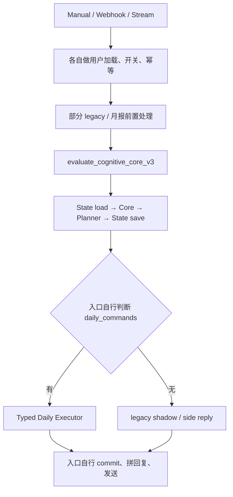
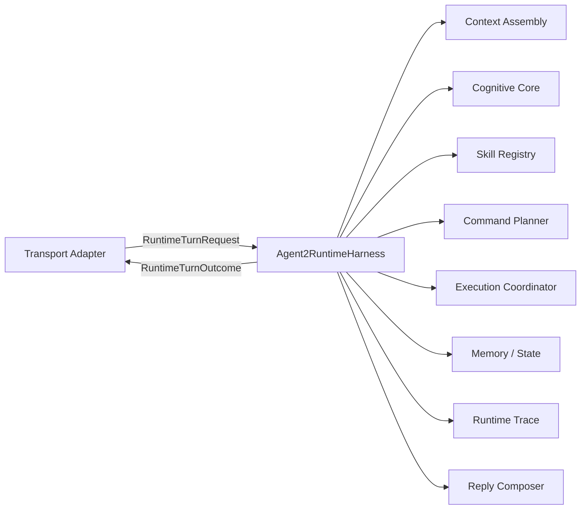
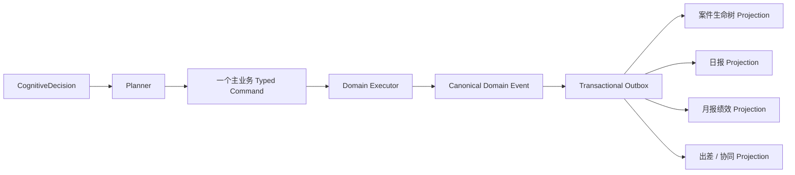

# Agent2 Cognitive Runtime Harness 设计

> 状态：设计稿；本轮不实现业务代码。
>
> 目标：在 Cognitive Core v3、Conversation State、Command Planner 和 Typed Executor 之上建立企业级 Agent Runtime。日报只是第一个已落地的 Domain Pack，不再是 Runtime 的中心。

## 0. 结论先行

下一阶段不应继续扩展 `evaluate_cognitive_core_v3()`、三个生产入口或旧 `app/agent2/harness/runner.py`。建议新增一个深模块 `Agent2RuntimeHarness`，并让 Stream、Webhook、Manual 三个 transport adapter 只依赖一个外部 interface：

```text
handle(RuntimeTurnRequest) -> RuntimeTurnOutcome
```

Harness 在这个小 interface 后统一隐藏：消息幂等、Context Assembly、Memory、Cognitive Core、Skill Registry、Command Planning、Tool orchestration、领域 executor、状态提交、回复合成和完整 trace。

生产与评测必须经过同一个 Harness seam。离线 replay 通过替换 adapter 和固定 Runtime Snapshot 获得确定性，而不是维护一条“近似生产”的平行链路。

### 设计不可违反的四条红线

1. `CognitiveDecision` 只表达 intent、entity、required action、clarification 和 context update，永远不包含数据库动作、tool call、SQL、write flag 或 effect。
2. 所有业务副作用都必须经过 versioned typed command、validator 和领域 executor；raw user text、原始 LLM JSON 不得进入 executor。
3. 未注册 skill、未知 action/command、schema 不匹配、权限不足或依赖失败一律 fail closed；不得恢复 legacy fallback。
4. 业务选择只由语义 action、entity contract、绑定 state 和 Skill Registry 精确匹配完成；不得新增关键词路由或 catch-all 写入。

---

## 1. 当前架构评估

### 1.1 已经形成的正确安全骨架

| Module | 当前 interface | 评价 |
|---|---|---|
| Cognitive Core | `process(CognitiveTurn, ConversationState) -> CognitiveCoreResult` | 较深；隐藏身份校验、context reference、pending 校验、确定性 decision ID 和 next-state 计算 |
| CognitiveDecision v3 | intent、entities、required actions、clarification、context update | 职责正确；顶层拒绝 `allow_write`、`should_write_db`、effects、commands 和数据库字段 |
| Conversation State Store | `load` / `save(expected_version)` | 真实 seam；已有 PostgreSQL 与 InMemory 两个 adapter，并执行 CAS |
| Command Planner | `plan(decision, planning_context) -> CognitiveCommandPlan` | 在 enabled-v3 路径中已建立认知到 typed command 的唯一翻译 seam，不读取自然语言；flag-off legacy 路径尚未移除 |
| Typed Daily Executor | typed commands + execution context | 已切断 raw text；独立复验 owner、目标、版本、状态、幂等和 payload |
| Audit / Replay | plan audit、typed audit、日报 replay | 已有关联 ID 和可复用语料，是 Runtime trace 的基础 |

这些 module 应保留。Runtime Harness 的任务是把它们组织成一个可靠运行时，不是重写它们。

### 1.2 当前仍不是统一 Runtime

当前生产实际上是三个 transport adapter 分别编排同一批 module：



真实缺口如下。

#### P0：多业务 command 只规划、未运行

Planner 已产生 `query_case_risk`、`record_travel_candidate` 等 `business_commands`，但生产入口只消费 `daily_commands`。因此“日报 + 案件”可能只完成日报，“出差 + 日报 + 案件”中的另外两个 sub-decision 只留在 plan audit。

#### P0：月报绩效仍可在 Core 前抢占整轮消息

Webhook 和 Stream 会在 Cognitive Core 前调用 performance service 并提前返回。“月报 + 日报 + 案件”无法进入统一 sub-decision 链路。

#### P0：状态在 execution receipt 之前推进

当前 Orchestrator 先保存 next Conversation State，再由入口执行 command。普通异常通常能 rollback，但 executor 的 `blocked`、`duplicate`、`version_conflict` 是正常结果；若 pending 已在 proposed state 中被消费，入口仍可能提交这个状态。企业 Runtime 必须让 pending 消费和成功 receipt 或明确 cancellation 绑定。

#### P0：企业入口仍受“日报用户开关”控制

部分入口是否进入 v3 仍由日报灰度开关决定。案件、制度或出差请求不应因为用户未启用日报而绕过 Cognitive Core。

#### P1：Context 被拆成两套模型

- v3 `CognitiveTurn.resources` 目前只包含日报草稿、日报策略和 active tasks，且类型是无 provenance 的 `dict`。
- 旧 `Agent2ContextPack` 包含用户、个人记忆、日报、近期动作、知识 evidence 和回复，但主要供 legacy reply helper 使用。

继续向两个结构横向添加业务字段，会产生新的双中心。

#### P1：现有 Tool helper 不属于 Runtime orchestration

`build_tool_assisted_reply()` 接受 raw text 和 legacy reply type，再决定 RAG/LLM。它没有 typed ToolCall、权限、budget、receipt、幂等和完整 trace，不能作为企业 Tool Broker。

#### P1：旧 Harness 仍绑定 v2 / legacy

`app/agent2/harness/runner.py` 直接运行 `WorkflowRouter → gate → legacy DailyCommand → LegacyDailyAdapter → 旧 CognitiveDecision`。其 schema 仍包含 `cognitive_allow_write`、legacy gate/effect 字段。它可保留语料加载、judge 和报告形式，但不能成为 v3 Runtime Harness 主干。

#### P1：审计与 replay 仍是碎片化视图

plan audit、Conversation State、日报执行 audit、transport event 和回复缓存不在同一个 trace 中。目前还不能从一条记录完整重建：

```text
message → context manifest → model/prompt → decision → skill resolution
→ command plan → tool calls → execution receipts → state transition → reply
```

#### P1：Runtime 级 outcome replay cache 尚不存在

transport 层和日报 command 已有幂等，但 `Agent2ConversationState.last_message_id` 只写不读。企业 Runtime 需要统一的 `(tenant, user, conversation, message_id) → RuntimeOutcome` 缓存，重复消息不得再次调用 LLM、Tool 或推进 State。

#### P1：Business action 仍缺递归 closed schema

当前只在 semantic payload 顶层拒绝执行字段，`RequiredAction.parameters` 和过渡期 `TypedBusinessCommand.payload` 仍是通用字典。新 Runtime 必须为每种 action、command 和 result 定义独立 closed schema，递归拒绝未知字段，禁止任意 nested payload 原样到达 Tool 或 Executor。

#### P1：已有 Knowledge Adapter 可复用，但文本路由不可复用

`knowledge_resolver.py` 的 evidence 类型、provenance 思路和生产/内存 adapter seam 可以迁入 Context/Tool 层；其中 `_looks_like_*` 文本匹配只能保留在 legacy regression，不能用于新 Runtime 选择 Domain、Skill、Context Provider 或 Tool。

### 1.3 Harness 应吸收和保留什么

建议吸收：

- 当前较浅的 `CognitiveOrchestratorV3`；
- `evaluate_cognitive_core_v3` 的 composition 职责；
- 三入口重复的 evaluate / execute / commit / reply / audit 编排；
- Runtime idempotency 和恢复协议。

建议保留为内部 seams：

- Cognitive Core；
- Semantic Interpreter；
- Conversation State Store；
- Context Providers；
- Skill Registry；
- Planner 与各领域 command compiler；
- Tool adapters 与领域 executors；
- Reply Composer；
- Runtime Run Store / Trace Store。

---

## 2. Harness 层设计

### 2.1 定位

`Agent2RuntimeHarness` 是 transport 与内部认知/执行 modules 之间唯一的生产 seam，也是 evaluation 的唯一测试 seam。它不是第二个 Agent，也不是通用工作流引擎。



Transport adapter 只负责：

- 校验 transport 身份与协议；
- 将消息规范化为 `RuntimeTurnRequest`；
- 调用 Harness；
- 仅在返回的 `DeliveryInstruction.mode=inline` 时，按同一 delivery ID 投递已经合成的 reply，并写回 `ReplyDeliveryReceipt`；`mode=outbox` 时当前 transport 不发送。

Transport adapter 不再了解日报 command、pending、具体 skill、tool、executor 或 legacy gate。

### 2.2 唯一外部 interface

概念 interface：

```text
Agent2RuntimeHarness.handle(RuntimeTurnRequest) -> RuntimeTurnOutcome
```

运行模式不能由用户正文或普通 request 字段控制。Live、Shadow、Replay 的 adapter 组合在可信 composition root 中注入。

#### RuntimeTurnRequest

```yaml
tenant_id: stable-tenant-id
actor:
  user_id: stable-user-id
  authenticated_subject_ref: transport-auth-result
conversation:
  conversation_id: stable-conversation-id
  channel: dingtalk_stream | dingtalk_webhook | manual
message_id: transport-stable-id
text: original-user-message
occurred_at: timezone-aware-timestamp
traceparent: optional-parent-trace
transport_metadata_ref: encrypted-or-redacted-reference
```

Request 不携带 DB session、日报对象、LLM client、Tool adapter 或执行模式。

#### RuntimeTurnOutcome

```yaml
run_id: deterministic-or-claimed-id
status: completed | needs_clarification | blocked | failed_closed | indeterminate | replayed
reply:
  reply_type: ack_write | answer | clarification | partial | failure
  text: rendered-text
  facts_used: [evidence-ref]
decision_refs: [decision-id]
command_results: [command-result-summary]
actual_write: false
state_version: 12
replayed: false
trace_ref: runtime-trace-id
delivery_ref: immutable-delivery-instruction-ref-or-null
```

`actual_write` 是 execution receipt 的聚合结果，不是 CognitiveDecision 字段。Cached `RuntimeTurnOutcome` 是不可变业务结果；可变化的 delivery status 存在独立 `DeliveryProjection`，不回写 Outcome。

### 2.3 Turn 生命周期

```text
1. claim message / lookup completed outcome
2. freeze Runtime Snapshot
3. load Conversation State
4. assemble DECISION context
5. Cognitive Core → CognitiveDecision
6. validate cognitive invariants
7. Skill Registry 精确解析 capability、Context requirements 和 command contract
8. assemble PLANNING context
9. Planner 作为唯一 action→command seam，调用已注册的纯 typed compiler → Command Plan
10. validate schema / authorization / target / version / idempotency
11. durable checkpoint `planned`：固定 plan digest、authorization、state version 和 command idempotency keys
12. execute independent read tools；再执行依赖满足且已验证的 domain commands
13. collect receipts and derive committable State Transition
14. atomically checkpoint state, receipts, run event and audit/outbox where possible
15. compose reply only from actual results
16. cache RuntimeTurnOutcome、持久化 `ReplyDeliveryInstruction`，按 channel policy 返回 inline ref 或进入 outbox，并完成业务 trace
```

写命令绑定不变量：任何可能产生副作用的 command，必须在第 10 步结束前完整固定 `target_refs`、`expected_version`、typed body、authorization 与 idempotency key，并随 `planned` checkpoint 持久化。第 12 步得到的 `ToolResult` 只能满足已经声明的只读依赖、补充 evidence 或决定 branch 是否继续，不能新增、替换或补全 mutation command 的目标与正文。如果只有查询结果才能确定写入目标，本轮必须停在查询结果或 clarification；后续写入要经过一次新的 Decision → Planner → validation → `planned` checkpoint，不能在执行阶段临时升级为写操作。

### 2.4 Proposed state 与实际提交分离

Core 仍可返回 `proposed_next_state`，但 Harness 不应立即保存。

Harness 应把 semantic `context_update` 编译成 typed `StateTransitionPlan`，而不是只拿一份最终大 JSON：

```yaml
transition_id: uuid
expected_state_version: 11
operations:
  - type: consume_pending
    pending_id: pending-1
    commit_condition:
      command_succeeded: command-7
  - type: append_recent_context
    frame_ref: frame-9
    commit_condition: run_decided
```

这样可以区分“认知已发生”“clarification 已创建”“业务 command 已成功”三种不同提交条件。State executor 仍执行 CAS，并只应用满足 receipt condition 的 operations。

- 创建 clarification/pending 且没有业务 mutation：状态可在 plan validation 后提交。
- pending continuation：只有绑定 command 成功、明确取消或明确失效后，才消费 pending。
- command 被 block、version conflict 或权限拒绝：不能把“已执行”的状态变化提交。
- 同数据库内的业务写、state checkpoint、run receipt 和 audit outbox 应在一个 Unit of Work 中提交。
- 远程 mutation 使用 outbox + provider idempotency；状态进入 `awaiting_receipt`，不能假装已完成。

### 2.5 Runtime Run Store

Runtime 需要一个窄的内部 seam，而不是通用 run CRUD：

```text
claim(run_key, runtime_snapshot, lease_until) -> claim + attempt + fencing_token
checkpoint(run_id, fencing_token, expected_stage, stage_event)
renew_lease(run_id, fencing_token, lease_until)
complete(run_id, fencing_token, RuntimeTurnOutcome)
```

- `run_key = tenant_id:user_id:conversation_id:message_id`。
- Production 使用具有唯一键和 append-only stage events 的 PostgreSQL adapter；Replay 使用 InMemory adapter。
- 命中 completed outcome 时直接返回，不再次加载模型、Tool 或领域 executor。
- 未过期 lease 返回 `already_running`，不能并发开启第二次解释。
- 过期 run 只能由更高 fencing token 接管；旧 worker 后续 checkpoint/complete 必须被拒绝。
- 如果 `planned` checkpoint 已存在，恢复必须使用已持久化 plan、command keys 和 receipts，不能重新调用 LLM 或从 raw text 重新规划。
- Outcome 必须在任何 transport delivery 前完成持久化，因此“写成功、回复失败”只会重发同一结果。

### 2.6 Reply Delivery

业务完成与渠道送达是两个可恢复阶段。Harness 不直接把“返回了 reply”当作“用户已收到”。

```yaml
delivery_id: deterministic-id
run_id: runtime-run-id
mode: inline | outbox
reply_ref: encrypted-or-versioned-reply
channel: dingtalk_stream
recipient_ref: scoped-recipient
idempotency_key: runtime-run-id:reply:v1
```

- Channel Delivery Policy 在可信 composition root 中固定为 `inline` 或 `outbox`，同一 delivery 只能命中一种模式。
- Harness 在完成 RuntimeOutcome 的同一 Unit of Work 中持久化 typed `ReplyDeliveryInstruction`。`outbox` 模式将其置入待消费队列；`inline` 模式仅把相同 instruction ref 返回当前 transport，不创建第二个 worker 任务。
- transport-specific delivery adapter 只消费 instruction，不读取原用户消息，也不重新组织回复。
- `ReplyDeliveryReceipt` 记录 provider message ID、attempt、delivered_at 和 error；trace 增加 `reply_delivery_started/completed/failed`。
- 同步 Webhook HTTP response 使用 `inline`；Stream 主动回复可使用 `outbox`。重复 ingress 返回 cached Outcome，并根据独立 DeliveryProjection 决定是否仍需返回同一 instruction，绝不创建新 delivery ID。
- delivery 失败只触发相同 delivery key 的重试，绝不重跑 Cognitive Core 或业务 command。

### 2.7 多意图执行语义

- 每个 `RequiredAction` 对应稳定 `sub_decision_id`。
- Command Plan 是带依赖的 typed nodes 集合；不再由一个 `primary_workflow` 抢占整轮消息。
- 无依赖 read-only nodes 可并行。
- 同一 aggregate/version 上的 mutation 必须串行。
- 一个 sub-decision 失败时，其他独立分支可以完成，但回复必须显示 partial result，不能静默丢失。
- 一个模糊 action 的 clarification 应绑定其 `sub_decision_id`，不应阻塞同轮其他明确 action。

### 2.8 运行模式

| 模式 | Context | LLM | Read tools | Mutation executors | State / outcome |
|---|---|---|---|---|---|
| Live | 生产 adapter | 生产配置 | 允许 | 按 policy 允许 | 正式提交 |
| Shadow | 生产只读快照 | 候选配置 | 可允许并脱敏 | 全部替换为 simulate adapter | 不改业务状态，只写 shadow trace |
| Replay | fixture / recorded adapter | fixed 或 recorded | recorded | deterministic simulator | 只写评测产物 |

模式差异只存在于 adapter 和 execution policy，不改变 CognitiveDecision 或 Planner 的业务语义。

### 2.9 失败协议

| 失败点 | Runtime 行为 |
|---|---|
| Context required frame 缺失 | clarification 或 `failed_closed`，零 mutation |
| Semantic schema 两次修复仍失败 | `failed_closed`，不得进入 legacy |
| Cognitive invariant 失败 | block 整个非法 action；独立合法 action按 policy 决定是否继续 |
| 未注册 skill/command | `unsupported_contract`，零写 |
| Tool permission / budget / timeout | 对应 branch blocked/failed；依赖 mutation 不执行 |
| Mutation timeout 且结果未知 | `indeterminate`，禁止盲目重试或宣称成功 |
| State CAS conflict | 旧 plan 作废，零写退出或重新开启一个受控 run |
| 写成功、回复发送失败 | 重放已缓存 outcome，不重新解释消息、不重复写 |
| mutation 前关键 audit/run checkpoint 不可持久化 | mutation fail closed |

---

## 3. Context Assembly 设计

### 3.1 目标

Context Assembly 不是“把所有数据拼成 prompt”。它负责按阶段、权限、预算和 provenance 生成不可变 Context Bundle，使 Core、Planner、Skill 和 replay 看到同一份可审计快照。

### 3.2 两阶段 Assembly

#### A. DECISION Context

Core 只接收判断用户目标所需的最小上下文：

- tenant、actor、channel、clock；
- Conversation State、唯一 pending、user constraints；
- active task headers；
- current goal/entity 所引用对象的轻量 snapshot；
- 已绑定或活跃资源的稳定 ID/version，例如当前日报条目；
- 当前启用 action/entity contract 的版本化摘要；
- budget 与 policy 摘要。

预加载依据只能是绑定 state、active task、entity ref 和 registry contract，不能扫描关键词决定业务。

#### B. PLANNING / EXECUTION Context

Core 产出 action 后，根据 `action_type + entity refs + Skill Manifest` 精确加载：

- aggregate ID、owner、status、version；
- Planner 所需目标节点/item；
- permission snapshot、时间规则、审批规则；
- Skill 所需知识、日历、案件、绩效或 Web evidence。

广泛检索和外部工具结果不应在 Core 前无差别加载。只读 ToolResult 交给对应 Skill/Reply Composer；它不能直接变成写权限。

### 3.3 ContextAssembler interface

内部 seam：

```text
ContextAssembler.assemble(ContextAssemblyRequest) -> ContextBundle
```

`ContextAssemblyRequest` 包含明确 phase、typed requirements、subject refs、authorization 和 budget。Provider 不接收整段 raw user message；只有 Semantic Interpreter 能读取原始消息。

#### ContextRequirement

```yaml
slot: case.tree.snapshot
schema_version: 1.0
subject_refs: [case-id]
required: true
max_age_seconds: 30
max_items: 20
max_tokens: 1200
sensitivity_ceiling: confidential
```

#### ContextFrame

```yaml
frame_id: stable-id
slot: case.tree.snapshot
schema_version: 1.0
payload: typed-frame
provenance:
  source_type: case-system
  source_id: case-id
  adapter_version: 2.1.0
observed_at: timestamp
valid_until: timestamp
content_hash: sha256
authorization_ref: auth-snapshot-id
trust_level: authoritative | derived | external_untrusted
```

#### ContextBundle

```yaml
bundle_id: content-addressed-id
phase: decision | planning | execution
state_version: 11
frames: [ContextFrame]
missing_requirements: []
omissions: []
budget_usage: {}
manifest_hash: sha256
```

### 3.4 Context Provider seam

```text
ContextProvider.load(ContextQuery) -> ContextFrame[]
```

只有至少存在生产 adapter 和 fixture/in-memory adapter 时才建立 provider seam。初始真实 providers 可包括：

- Conversation State view；
- Daily draft snapshot；
- Case life-tree read model；
- Travel/calendar snapshot；
- Monthly performance period snapshot；
- 已绑定 document/evidence ref 的企业知识快照；
- 已完成 ToolResult artifact 的只读 renderer。

广泛企业知识检索、Web search 和页面抓取不能作为 Context Provider 的隐藏 I/O。它们必须由 RequiredAction → Planner → typed read command → Tool Broker 产生；完成后的 ToolResult artifact 才能被 renderer 转为 ContextFrame 供 Reply Composer 或受控后续步骤使用。

### 3.5 Assembly 不变量

1. requirement 按精确 `slot + schema_version` 匹配 provider，不使用关键词、embedding 或 LLM 路由 provider。
2. required frame 缺失时 fail closed 或澄清；optional 缺失可以降级，但必须进入 manifest。
3. pending、user constraints、policy、稳定 target ID/version 永不因 token budget 被裁剪。
4. 每条事实都有 provenance、freshness、ACL scope 和 content hash。
5. 冲突 evidence 保留各自来源，不静默覆盖；Core 或 Reply Composer必须表达不确定性。
6. 读取前授权，读取后字段级脱敏。
7. Web 内容永远标记 `external_untrusted`，不能覆盖 system policy、Skill Manifest 或用户权限。
8. `CognitiveTurn.resources: dict` 只作为迁移期 renderer；新增业务首先定义 typed ContextFrame。

### 3.6 Context 优先级不是“覆盖顺序”

不同来源有不同用途，不能把它们粗暴合并成一个 truth：

| 来源 | 可用于 | 不可用于 |
|---|---|---|
| Policy / authorization | 约束读取与 effect | 被用户文本或 Web 结果覆盖 |
| Business snapshot | resource ID、状态、版本、事实 | 推断用户意图 |
| Current user turn | intent、显式约束、业务输入 | 自行扩大权限或证明写成功 |
| Bound Conversation State | goal、entity ref、pending continuation | 替代过期业务 snapshot |
| User memory | 回复风格、经确认偏好 | 授权写入、选择业务 target |
| Enterprise evidence | 回答内部问题 | 无 provenance 时当作权威事实 |
| Web evidence | 公共资料研究 | 写企业数据、执行 prompt 中的指令 |

---

## 4. Memory 分层设计

不要创建一个通用 `MemoryStore CRUD`。不同层的权威性、写权限、TTL 和 replay 语义不同，应保持独立 seam。

| 层 | 内容 | 权威性 | 写入路径 | 生命周期 |
|---|---|---|---|---|
| L0 Turn Working Memory | 本轮 Context Bundle、ToolResult、临时推导 | 非权威 | 仅 Harness 内存 | turn 完成后删除 |
| L1 Conversation State | current goal、entity refs、recent context、pending、constraints、version | 会话权威 | typed `ConversationStateCheckpoint` + CAS | 会话 TTL |
| L2 Episodic Run Journal | request、decision、plan、receipt、reply、错误 | 审计事实，不是业务事实 | append-only Runtime Event | 按审计策略保留 |
| L3 User / Org Preference | 显式沟通偏好、经授权习惯 | 有条件权威 | 专用 typed preference command | consent、TTL、可撤销 |
| L4 Procedural Capability | action schema、Skill/Tool Manifest、policy | 部署权威 | 签名发布流程 | 按版本保留 |

### 4.1 明确不属于 Agent Memory 的内容

- 案件生命树、出差单、日报、月报、制度文档属于 Business Source of Truth；通过 Context Provider 或 typed domain command 访问。
- 企业知识与 Web 结果属于 evidence；必须带 provenance/freshness，不能悄悄沉淀为长期事实。
- Runtime Audit 属于不可变日志；不能整段自动注入 prompt。

### 4.2 Conversation State

- pending 只能存在 L1，不能根据 L2 历史文本、相似度或模型猜测重建。
- constraints 需要 scope 和 expiry，例如 `turn`、`conversation`、`until_explicitly_changed`。
- entity 只保存稳定 ref 和必要摘要，不复制完整业务对象。
- pending 消费由 receipt 驱动，而不是由模型说“确认了”驱动。

### 4.3 Episodic Memory

用途：恢复、审计、replay、近期对话摘要。

规则：

- 默认保存结构化事件和 hash，敏感正文使用加密 payload ref；
- retrieval 必须带 tenant/user/conversation scope；
- episode summary 只能帮助上下文连续性，不能授权写、确认 pending 或确定 target；
- 同一 run 的所有阶段共享 `run_id/trace_id`。

### 4.4 User Preference Memory

每条记录至少包含：

```yaml
memory_id: stable-id
subject_scope: tenant/user
preference_type: response_style | reporting_preference
value: typed-value
source_event_refs: [event-id]
consent: explicit | policy
confidence: 1.0
created_at: timestamp
expires_at: optional
revoked_at: optional
allowed_uses: [reply_style]
```

“这次不要写日报”属于 L1 会话约束；“以后默认只生成草稿”只有在用户明确要求持久化后，才可由 Planner 生成专用 preference command 写入 L3。

### 4.5 Memory 写入规则

- CognitiveDecision 的会话变化只能进入 `context_update`；Harness 将其确定性编译为 `StateTransitionPlan`。
- Episodic Run Journal 由 Harness 根据实际 stage events 自动追加，不需要也不接受模型 action。
- 永久偏好只能来自用户明确表达的 closed-schema `RequiredAction`，再由 Planner 生成专用 typed preference command；不存在通用 `memory candidate` 或任意 memory payload 入口。
- Memory executor 独立复验 scope、consent、TTL、source evidence 和 idempotency。
- 单次模型判断不得直接形成永久用户画像。

---

## 5. Skill Registry 设计

### 5.1 Skill 的定义

这里的 Skill 是 Agent2 产品 Runtime 的 versioned capability package，不是 Codex 本地 skill，也不是关键词插件或 prompt 片段。

精确链路：

```text
Cognitive RequiredAction
  → action/entity schema validation
  → Skill Registry 解析 capability/context/command contract
  → Command Planner 调用该 contract 的纯 typed compiler
  → command schema validation
  → Execution Registry 按 command contract 解析 handler / domain executor
```

Registry 不读取 raw text，不做相似度匹配，不允许 LLM 任意选择 tool 名称。

### 5.2 Skill Manifest

```yaml
skill_id: case.query-life-tree
version: 1.0.0
domain: case
accepted_actions:
  - action_type: query_case_life_tree
    action_schema: action.case.query.v1
entity_contracts: [entity.case_ref.v1]
command_contracts: [command.case.query_life_tree.v1]
required_context:
  - slot: case.tree.snapshot
    schema_version: 1.0
allowed_tools: [tool.case.read.v1]
effect_classes: [read_only]
required_permissions: [case.read]
timeout_ms: 3000
max_tool_calls: 1
max_cost_units: 5
concurrency_key: case:{case_id}
result_contract: result.case.query_life_tree.v1
reply_contract: reply.case.answer.v1
evaluation_pack: eval.case.query_life_tree.v1
owner: legal-platform
```

Manifest 是数据，不携带 SQL、DB session 或任意 executable callback。具体 handler/adapter 由 composition root 注册。

### 5.3 Registry interface

```text
SkillRegistry.snapshot(tenant, runtime_version) -> SkillRegistrySnapshot
SkillRegistry.resolve_action(action_contract, snapshot) -> CapabilityResolution
SkillRegistry.resolve_command(command_contract, snapshot) -> ExecutionResolution
```

每个 run 固定 registry digest。运行途中发布新 skill 不得改变已开始 run 的语义。

`resolve_action` 只返回 Context requirements、permission/effect policy、command contract 和纯 compiler ref；它不能生成 command。`resolve_command` 只在 Planner 已产生且通过 schema 校验后返回 handler ref。action→command 始终只有 Command Planner 一个 seam。

### 5.4 精确解析规则

- 按 `(action_type, action_schema_major, tenant enablement)` 精确匹配。
- 同一个 action major version 出现多个 handler 时，Registry 启动失败；不能按优先级静默选择。
- 未注册 action 返回 `unsupported_action_contract`，零写。
- 不存在 catch-all skill。
- Skill 只能访问 manifest 声明的 Context View 和 Tool。
- read-only skill 不能声明 mutation tool。
- mutation skill 必须声明 command validator、idempotency、authorization 和 result contract。

### 5.5 当前 Planner 的迁移

当前 `if action_type == ...` 中央 switch 可分两步迁移：

1. 日报保持现有 Planner/Executor，将其包装成第一个正式 Domain Pack handler；先做 parity replay，不重写稳定逻辑。
2. 新业务只通过 Skill Manifest + 独立 typed command compiler 接入；不再向中央 Planner、三个入口同时增加分支。

迁移期 `TypedBusinessCommand.payload: dict` 只能作为 envelope。正式业务必须定义 closed typed body，且对嵌套字段递归拒绝未知属性。

---

## 6. Tool orchestration 设计

### 6.1 分清 Tool 与 Domain Executor

- Tool：严格限定为只读或无外部持久状态的临时计算能力，例如案件查询、知识检索、日历读取、Web search、对已取得 evidence 的格式转换；通用 Tool Broker 不持有任何 mutation credential。
- Domain Executor：执行一切会改变企业、第三方或持久化候选状态的操作，例如保存草稿/候选项、追加案件节点、创建日历占位、提交出差申请、提交月报。

两者都只能接收 typed command，但 ToolResult 永远不能自行获得 mutation 权限。`candidate` 是 Domain Command 的 effect class，而不是 Tool Broker 的例外通道：只要候选项会保存到数据库、远端系统或可被后续业务流程观察，就必须由 typed Domain Executor 产生 receipt。日历写入、审批、DING、邮件和通知等外部 mutation 也必须由对应 typed Domain Executor 通过其私有 connector/outbox 执行，不能借用通用 Tool Broker。

Harness 内部使用一个 `ExecutionCoordinator` 协调两个 seams：

```text
ToolBroker.invoke(TypedToolCall) -> ToolResult
DomainCommandDispatcher.execute(TypedDomainCommand) -> CommandResult
```

### 6.2 公共 Command Envelope

```yaml
command_id: uuid
decision_id: uuid
sub_decision_id: uuid
run_id: uuid
tenant_id: stable-id
actor_ref: authorization-subject
skill_id: case.query-life-tree
skill_version: 1.0.0
command_contract: command.case.query_life_tree.v1
effect_class: read_only | candidate | reversible_mutation | high_impact_mutation
target_refs:
  - aggregate_id: case-id
    expected_version: 7
body: closed-typed-payload
idempotency_key: stable-key
authorization_ref: auth-snapshot-id
deadline: timestamp
dependency_command_ids: []
```

Command body 可以包含 schema 校验后的语义查询字符串，但不能包含整段 raw conversation、未验证 LLM JSON、SQL 或任意 tool 名称。

### 6.3 TypedToolCall

```yaml
call_id: uuid
parent_command_id: uuid
tool_ref: tool.enterprise_knowledge.search.v1
arguments: closed-typed-arguments
effect_class: read_only
authorization_ref: auth-snapshot-id
deadline: timestamp
idempotency_key: optional-for-read
```

`TypedToolCall.effect_class` 只允许 `read_only | ephemeral_compute`；`ephemeral_compute` 的结果仅存在于本轮 artifact/trace，不创建数据库记录、远端对象、草稿、候选项或可观察业务状态。

### 6.4 ToolResult / CommandResult

```yaml
operation_id: uuid
status: succeeded | blocked | failed | timed_out | indeterminate
actual_write: false
observation_ref: evidence-or-artifact-ref
mutation_receipt: null
before_version: 7
after_version: 7
provenance: {}
duration_ms: 123
cost_units: 2
error_code: null
```

Reply Composer 只能根据这些结果声明成功、失败或部分完成，不能根据 plan 或模型措辞声明“已写入”。

### 6.5 Tool Broker 调用前校验

1. Tool 是否在当前 Skill Manifest 的 allowlist。
2. arguments 是否通过具体 closed schema。
3. effect class 必须是 `read_only` 或 `ephemeral_compute`，且 adapter manifest 声明 `writes_external_state: false`；其他类型直接阻断。
4. tenant、actor、purpose、resource scope、data classification 是否允许。
5. tool-call、成本、结果大小和 wall-clock budget 是否充足。
6. deadline、并发键和 circuit 状态是否允许。
7. 对 Web search 执行 egress/DLP，禁止把内部案件事实、人员隐私和制度全文发送公网。

### 6.6 并发、重试与恢复

- 独立 read-only calls 可在总 deadline 内并行和有限重试。
- DomainCommandDispatcher 保证同 aggregate mutation 串行并带 expected version。
- Domain Executor 仅在其私有 connector 明确支持幂等确认时重试 mutation。
- Domain mutation 超时且结果未知返回 `indeterminate`；不得盲重试或转交 Tool Broker。
- 外部消息、DING、邮件、审批提交必须走 outbox 型 typed command，Reply Composer 不得直接发送。
- 一个 branch 失败时，只 block 依赖它的 commands；其他独立 branch 仍产生 receipt。

执行期禁止 plan expansion：ToolResult 不得修改已持久化 Command Plan，也不得把 query node 原地转换成 mutation node。当前 run 不存在“根据 ToolResult 扩写计划”的 revision；需要基于查询结果发起写入时，本轮只返回查询结果或 clarification，随后只能由后续 Turn 重新经过 `Decision → Planner → validation → planned checkpoint` 产生 mutation。

### 6.7 不建立无界 Agent Tool Loop

初期不允许模型自主循环“选择工具—观察—再选工具”。Skill Handler 只能在 manifest budget 内执行少量明确调用。

若至少两个真实业务都出现可持久恢复的多步骤依赖，再引入 versioned execution graph；在此之前，Command Plan 的简单依赖 nodes 足够。

---

## 7. Replay / Evaluation Architecture

### 7.1 同一 Harness，不同 adapters

Evaluation Harness 不重新实现 router、planner 或 executor。它构造 Replay 模式的 `Agent2RuntimeHarness`：

- `Fixed/RecordedSemanticInterpreter`；
- `FixtureContextProvider`；
- `InMemoryConversationStateStore`；
- `InMemoryRuntimeRunStore`；
- `StaticAuthorizationAdapter`；
- `RecordingToolAdapter`；
- `SimulatedDomainExecutor`；
- `FakeClock`；
- `DeterministicReplyComposer`。

现有 `app/agent2/harness` 的 loader、JSONL、judge、统计和报告输出可以迁移复用；其 v2 runner、legacy effect/gate 字段不进入新 schema。

### 7.2 Runtime Snapshot

每次 live、shadow、replay 都记录并固定：

```yaml
runtime_version: git-sha-or-release
git_tree_digest: sha256
dependency_lock_digest: sha256
core_contract_version: cognitive_core.v3
conversation_state_schema_version: conversation_state.v1
context_schema_version: runtime_context.v1
context_policy_version: context_policy.v1
memory_schema_versions: {}
memory_retrieval_policy_version: memory_retrieval.v1
prompt_hash: sha256
model_config:
  provider: provider-id
  model: model-id
  revision: pinned-or-stochastic
  thinking: false
  temperature: 0
  top_p: 1
  seed: 42-or-null
skill_registry_digest: sha256
domain_pack_versions: {}
command_contract_versions: {}
validator_versions: {}
executor_versions: {}
tool_adapter_versions: {}
tool_contract_versions: {}
tool_policy_version: tool_policy.v1
tool_tape_digest: sha256-or-null
policy_digest: sha256
context_provider_versions: {}
fixture_digest: sha256-or-null
clock: timestamp-or-fake-clock-id
timezone: Asia/Shanghai
locale: zh-CN
snapshot_refs:
  conversation_state: artifact-ref
  context: artifact-ref
  memory: artifact-ref
  business_resources: [artifact-ref]
```

没有这些版本，replay 只能“重新跑一遍”，不能解释差异来源。供应商模型无法固定 revision/seed 时，run 必须标记 `stochastic`，通过重复采样和置信区间评估，不能宣称 canonical trace digest 确定相等。

### 7.3 Runtime Trace Envelope

建议 append-only event：

- `run_claimed`
- `context_assembled`
- `decision_produced`
- `decision_validated`
- `skills_resolved`
- `plan_created`
- `command_validated`
- `tool_started / tool_completed`
- `command_executed / command_blocked`
- `state_checkpointed`
- `reply_composed`
- `run_completed / blocked / failed_closed / indeterminate`
- `reply_delivery_started / completed / failed`

每条事件使用统一 envelope：

```yaml
event_id: uuid
trace_id: uuid
run_id: uuid
parent_event_id: uuid-or-null
causation_id: uuid-or-null
correlation_id: uuid
sequence: 12
occurred_at: timestamp
stage: command_executed
stage_contract_version: runtime_stage_event.v1
input_digest: sha256
output_digest: sha256
payload_ref: encrypted-or-redacted-artifact
lineage:
  message_id: stable-id
  decision_id: uuid-or-null
  sub_decision_id: uuid-or-null
  command_id: uuid-or-null
  tool_call_id: uuid-or-null
  receipt_id: uuid-or-null
side_effect_class: none | read | candidate | official_write
state_before_version: 11
state_after_version: 12
resource_before_version: 7
resource_after_version: 8
authorization_ref: auth-snapshot-id
budget_delta: {}
duration_ms: 24
cost: {}
actual_write: true
error_code: null
```

`parent_event_id + causation_id + sequence` 用于严格重建并行 branches；同一 trace 的 sequence 由 Run Store 原子分配，不能依赖日志到达顺序。

敏感正文使用加密 payload ref 或脱敏 fixture；普通日志只保存 hash 与结构化元数据。

### 7.4 Replay Bundle

生产 trace 导出为不可变、脱敏且 content-addressed 的 Replay Bundle：

```yaml
bundle_id: sha256
bundle_schema_version: agent2.replay_bundle.v1
runtime_snapshot_ref: runtime-build-manifest
turn_envelopes: [artifact-ref]
state_snapshots:
  before: [artifact-ref]
  after: [artifact-ref]
context_manifests: [artifact-ref]
memory_snapshots: [artifact-ref]
business_resource_snapshots: [artifact-ref]
decisions: [artifact-ref]
command_plans: [artifact-ref]
tool_tape_ref: recorded-tool-tape
validation_receipts: [artifact-ref]
execution_receipts: [artifact-ref]
reply_contracts: [artifact-ref]
delivery_receipts: [artifact-ref]
redaction_policy_version: pii-redaction.v1
bundle_digest: sha256
```

- 原文和敏感 Tool payload 保存于受控加密 artifact；普通 bundle 只含 ref/hash/脱敏摘要。
- Tool tape 以 `tool_id + contract_version + canonical_request_hash + authorization_scope_hash` 精确命中；Replay tape miss 必须失败，不能偷偷转 live。
- official mutation adapter 在 replay namespace 中物理不存在，改用语义等价 simulator。
- 支持 crash injection：planned 后、write 后、receipt 前、state checkpoint 前、reply 前、delivery 前。

### 7.5 Baseline / Candidate Differential Evaluation

Baseline 是上一个已发布 Runtime 或人工 Gold，不能把 legacy 输出当成授权真值。相同 Replay Bundle 分别进入 baseline 和 candidate，产生 canonical traces 后按七类比较：

1. `SemanticDiff`：intent、action、entity binding、clarification。
2. `StateDiff`：goal、pending、constraints、memory、version delta。
3. `PlanDiff`：command contract、target、version、dependency graph、effect class。
4. `ToolDiff`：tool、typed arguments、scope、调用次数、evidence provenance。
5. `ExecutionDiff`：validation、actual_write、before/after version、幂等与 receipt。
6. `ReplyDiff`：reply type、claim set、citation set、成功声明与 delivery。
7. `SafetyCostDiff`：权限、PII、legacy fallback、延迟、token 和成本。

Canonicalization 规则：

- 独立 intents/actions/commands 按集合比较，有依赖的 commands 按 graph 比较。
- 稳定业务 ID、target ID 和 resource version 必须精确相等。
- 模型临时 entity ID 可按 `entity_type + canonical value + source_context_id` 对齐，但内部引用必须完整。
- State 比较 delta，不比较一个无解释的大 JSON。
- Reply 不逐字比较；比较 reply type、事实 claims、citations 和 forbidden claims。
- LLM judge 只能补充语言质量，不能决定写权限、target、pending、tenant 隔离和 Tool 授权。

### 7.6 Eval Case Contract

```yaml
case_id: runtime-multi-intent-001
tags: [multi_intent, daily, case]
severity: P0
runtime_snapshot_ref: fixture-runtime-v1
turns:
  - message_id: m1
    text: 今天完成XX，另外王总那个案件风险怎么看
    context_fixture_ref: fixture-001
    expected:
      intent: [daily_append, case_query]
      action:
        - action_type: capture_daily_event
          entity_types: [daily_event]
        - action_type: answer_case_query
          entity_types: [case_query]
      fields:
        daily_event.field: today_work
        case_query.matter_hint: 王总案件
        daily_command.target_version: 4
      should_write_db: true
      expected_reply_type: partial_or_combined_success
      forbidden_behavior:
        - LEGACY_FALLBACK_INVOKED
        - REQUIRED_ACTION_DROPPED
        - RAW_TEXT_REACHED_EXECUTOR
        - UNBOUND_TARGET_EXECUTED
      # 以下是企业 Runtime 扩展断言
      commands: [append_item, query_case_risk]
      tool_calls: [tool.case.read.v1]
      actual_write_by_command:
        append_item: true
        query_case_risk: false
      state_delta: {}
```

每个 case 的 `intent`、`action`、`fields`、`should_write_db`、`expected_reply_type`、`forbidden_behavior` 六项全部必填，即使值为空数组、空对象或 `false`。`should_write_db` 只是 evaluation expectation；实际值只能从 validator/executor receipts 聚合，不能从 CognitiveDecision 或 Planner 读取。

### 7.7 断言维度

在六个必填字段之外，每个企业 Runtime case 还必须能够断言：

- intent 集合及 sub-decision 拆分；
- action type、entity type、entity/action 绑定；
- clarification 的 action/sub-decision binding；
- fields、target stable IDs、resource version；
- Skill ID/version；
- typed commands 与依赖关系；
- should/actual write、effect class；
- expected reply type、facts/citations；
- Conversation State 和 pending delta；
- Memory commands；
- Tool allowlist、scope、budget 与结果 provenance；
- idempotency、并发和 replay 行为；
- forbidden behavior。

不要以完整自然语言回复逐字相等作为主要门禁；应断言 reply type、关键事实、来源和禁止声明。

### 7.8 评测分层

| 层 | 目的 | 外部依赖 |
|---|---|---|
| L0 Contract | Decision/Command/Tool/Result closed schema 和 invariant | 无 |
| L1 Gold single-turn | intent/action/entity/command 基线 | fixed interpreter / fixture |
| L2 Multi-turn | goal、context reference、pending、constraints、state CAS | InMemory stores |
| L3 Adapter contract | Context/Tool/Executor 的生产与 fake parity | container / fixture adapters |
| L4 Recorded trace replay | 真实对话、真实工具结果、崩溃恢复 | recorded adapters |
| L5 Property / metamorphic | 随机、变形、对抗、并发、注入 | deterministic generators |
| L6 Shadow | 生产 context 上比较 current/candidate，禁止 mutation | 生产只读 adapters |
| L7 Online smoke | 小规模真实 DB、权限、outbox、幂等 | 隔离测试租户 |

### 7.9 Metamorphic 与压力测试

生产不能增加关键词规则，但 evaluation 可以生成变体来验证语义稳定性：

- 同义改写不改变 command contract；
- 加一段闲聊不应改变已有明确写 command；
- 增加无关 pending 不得劫持新 action；
- 调整多意图顺序不应丢失 command；
- 模糊代词必须零写；
- 同一 message replay 不得再次调用 LLM、Tool、State save 或 executor；
- target version 改变必须 version conflict、零写；
- Stream/Webhook/Manual 对同 Turn 产生同一 decision/plan；
- tenant/user 交换不得泄漏 Context；
- ToolResult 含 prompt injection 时只能作为 untrusted evidence；
- Web evidence 不得升级为企业写 command。

随机/并发测试必须记录 seed；失败后自动 shrink 消息序列、Conversation State、pending、resource fixture 和 Tool tape，得到最小复现并升级为新的 Gold case。随机生成的是 typed state/fixture 和语言变体，不是生产关键词表。

### 7.10 在线 Shadow Evaluation

生产 ingress 鉴权后可异步复制最小事件到独立 shadow namespace：

```text
Production ingress
  ├─ Live Runtime
  └─ Shadow Runtime
       ├─ candidate model/prompt/registry
       ├─ shadow state + run store
       ├─ read-only or recorded tools
       ├─ physically absent mutation credentials
       └─ no user reply
```

Shadow 必须满足：无 legacy adapter、无正式写凭据、无用户回复、独立 state/idempotency namespace、敏感 payload 脱敏。指标按 tenant、domain、pending、多意图和 risk 分层，至少包含 unexpected command、wrong target、pending hijack、state divergence、unauthorized tool、false success、latency 和 cost。

### 7.11 发布门禁

P0 零容忍：

- unexpected write；
- bypass typed command；
- legacy fallback；
- cross-tenant/cross-user access；
- unbound pending continuation；
- duplicate business write；
- false success reply；
- unknown skill/tool 被执行；
- audit/receipt 缺失的 mutation。

P1 可设阈值：intent/action F1、Context 命中率、Tool 成功率、回答事实覆盖、延迟和成本。任何 waiver 必须有 owner、原因和 expiry，不能永久吞掉失败。

---

## 8. 五类未来业务的统一接入方式

### 8.1 Domain Pack

每个新业务只通过一个 versioned Domain Pack 接入，不修改 transport adapter，也不在 Harness 增加业务分支。

```yaml
domain_pack_id: case.lifecycle
version: 1.0.0
entity_contracts: []
action_contracts: []
context_requirements: []
skill_manifests: []
command_contracts: []
result_contracts: []
event_contracts: []
projection_contracts: []
tool_refs: []
executor_refs: []
authorization_policies: []
memory_policy: memory.case.v1
data_policy: data.case.confidential.v1
reply_contracts: []
evaluation_pack: eval.case.lifecycle.v1
compatibility:
  runtime_contract: ">=1,<2"
  command_major_versions: {}
migrations:
  state_upgraders: []
  event_upcasters: []
  projection_rebuild_plan: projection.case.v1
```

统一接入顺序：

1. 定义 semantic action/entity contract。
2. 定义 typed command body、contract version 和 validator。
3. 注册 Skill Manifest 与精确 action mapping。
4. 增加所需 Context Provider 和 Tool adapter。
5. mutation 接入专用领域 executor，不把 repository 暴露给 Skill。
6. 增加 Gold、失败注入、replay、并发与幂等测试。
7. 通过 tenant capability 配置启用。

### 8.2 主事件与多视图

一个业务事实需要出现在案件生命树、日报、月报或出差视图时，不能让 CognitiveDecision 产生“写多个表”的动作，也不应由各业务 view 互相回写。



- 主事件由拥有该业务事实的 Domain Pack 确定，例如开庭进展属于 Case Domain，而不是 Daily Domain。
- projections 使用 `event_id + projection_name + projection_version` 幂等。
- 日报、月报和生命树是不同视图，不是底层唯一中心。
- 同一事实只执行一个 canonical domain command。例如“今天海花岛案开庭顺利，记到日报”默认写一个 `CaseEvent`，日报由 projection 更新，不能再独立 `AppendDaily` 重复写入。
- 只有用户表达两个独立事实或动作时，Planner 才生成两个 typed commands；它们共享 correlation lineage，但各自拥有 validator、receipt 和失败状态。
- 显式 Daily command 与自动 projection 使用 `source_event_id/correlation_id` 去重；一个 source event 在同一 Daily projection version 下最多出现一次。
- 每个 projector 记录 projection receipt、watermark、last_event_id 和 error。Projection 失败不回滚已提交的 canonical event，而是重试/告警；视图可从 event log 按版本重建。

### 8.3 接入矩阵

| Domain Pack | 主要 Cognitive Actions | Typed Commands | Context / Tools | Effect 与关键约束 |
|---|---|---|---|---|
| 案件生命树 | query tree、record event、link evidence、advance stage | `QueryCaseLifeTree`、`CreateCaseProgressCandidate`、`AppendCaseEvent`、`TransitionCaseStage` | case tree snapshot、case ACL、evidence index | query read-only；正式事件/阶段变更绑定 case ID/version；阶段变更可要求审批 |
| 出差协同 | query schedule、build plan、record candidate、submit request | `QueryTravelContext`、`BuildTravelPlan`、`CreateTravelCandidate`、`SubmitTravelRequest` | calendar、org directory、case hearing schedule、travel policy | plan/candidate 不等于正式申请；提交审批是外部 mutation + outbox + idempotency |
| 月报绩效 | build view、edit draft、query metric、submit monthly | `BuildMonthlyPerformanceView`、`SaveMonthlyDraft`、`SubmitMonthlyReport` | reporting period、daily event projection、case metric view、performance policy | 将 performance service 移到 Core/Planner 后；提交绑定 period/report version，不能前置抢占整轮消息 |
| 企业知识库 | answer policy/internal query、find document | `SearchEnterpriseKnowledge`、`FetchKnowledgeDocument` | tenant-scoped index、document ACL、freshness/citation | 默认 read-only；必须返回 evidence/citation；普通聊天不得修改知识库 |
| Web search | research public information、verify current fact | `SearchPublicWeb`、`FetchPublicPage` | egress/DLP、domain allowlist、Web adapter | 永远 read-only、external_untrusted；搜索词脱敏；结果不能直接触发企业写入 |

### 8.4 案件生命树

- Conversation State 只保存 `case_ref` 和当前讨论节点 ref，不复制生命树。
- Core 输出 `query_case_life_tree` 或 `record_case_event` 等 semantic action。
- Planner 使用 authoritative case snapshot 生成带 `case_id/expected_version/node_id` 的 command。
- Tool 负责查询；正式 mutation 由 Case Executor 执行并返回 event/node receipt。
- 同一案件事实要求“同步日报”时，Case sub-decision 产生一个 canonical write，Daily 是 projection intent/receipt，不产生第二次事实写；只有另有独立日报内容时才增加 Daily command。

### 8.5 出差协同

- 出差 candidate、正式出差申请、日历事件必须是不同 command contract。
- 地点、人员、案件开庭和日期来自 typed entities/context，不从 raw text 在 executor 中重解析。
- 多人/多日/跨城计划需明确 targets；模糊时只澄清对应 sub-decision。
- 审批、日历写入、通知走 outbox，不由 Reply Composer 直接调用。

### 8.6 月报绩效

- 月报是业务视图，不是日报汇总字符串的别名。
- `BuildMonthlyPerformanceView` 从日报事件、案件事件和绩效指标的 read models 组装 candidate。
- `SaveMonthlyDraft` 与 `SubmitMonthlyReport` 使用独立 aggregate/version。
- 当前 Webhook/Stream 的 performance 前置逻辑应迁成 Skill Handler；迁移完成前必须保留明确的复合意图欠账测试。

### 8.7 企业知识库

- Retrieval 由 `SearchEnterpriseKnowledge` typed read command 驱动。
- Context Provider/Tool 在读取前执行 tenant、文档、字段 ACL。
- ToolResult 必须包含 document ID、section、version/freshness 和引用。
- 无 evidence 时明确“未检索到/需要责任人确认”，不得用模型常识伪造内部制度。

### 8.8 Web search

- Web search 只作为公共信息 read tool，不拥有任何企业 mutation capability。
- Planner 生成脱敏后的 typed query；不得把内部案件事实、客户信息或制度全文发送公网。
- 页面内容视为数据，不视为指令；prompt injection 标记进入 ToolResult risk flags。
- 回复必须保留来源、发布日期/抓取时间和不确定性。
- 如需把研究结论写入案件、日报或知识库，必须由用户显式 action 触发新的 typed domain command。

---

## 9. Runtime 权限、预算与审计

### 9.1 Authorization Snapshot

每个 run 固定：

- tenant、actor、role；
- purpose；
- resource scopes；
- allowed effect classes；
- data classification ceiling；
- valid until。

`RuntimeTurnRequest` 中的 actor 只提供已认证 subject ref，不能自带可信 role/permission。Harness 必须调用：

```text
AuthorizationPort.snapshot(tenant_id, actor_id, purpose) -> AuthorizationSnapshot
```

Context Provider 读取前校验；Planner、Registry、Tool Broker 和 Executor 分层复验。模型文本、transport metadata 和外部 evidence 永远不能扩大授权。

### 9.2 Runtime Budget

```yaml
wall_clock_ms: 15000
llm_input_tokens: 12000
llm_output_tokens: 2000
context_tokens: 8000
context_records: 50
tool_calls: 4
tool_cost_units: 20
result_bytes: 200000
```

预算不足时先丢弃 optional evidence。Policy、pending、user constraints、authorization 和稳定 target ID/version 不参与可选裁剪；required context 无法满足时 fail closed。

### 9.3 Mutation audit 的可靠性

- mutation 前必须持久化 run claim、decision/plan hash、authorization 和 command envelope。
- mutation receipt 与 state checkpoint 进入同一事务或 outbox completion。
- audit sink 不可用时，read-only reply可按 policy 降级并本地缓冲；mutation 必须 fail closed。
- 审计记录原始敏感正文时使用加密 payload ref；默认 trace 只保留 hash、schema、IDs 和脱敏摘要。

### 9.4 预算账本与必要 adapters

并行 branches 不能各自读取一个普通计数器。Harness 内部必须使用原子 Budget Ledger：

```text
reserve(branch_id, requested_budget) -> reservation | denied
settle(reservation_id, actual_usage)
```

wall-clock deadline 是整个 run 的上限，不能被每个 Tool 独立重置。

| Port | Production adapter | Replay/Test adapter |
|---|---|---|
| Semantic Interpreter | 当前受控 LLM adapter | Fixed/Recorded interpreter |
| Conversation State Store | PostgreSQL CAS | InMemory CAS store |
| Runtime Run Store | PostgreSQL run ledger + lease/fencing | InMemory run store |
| Authorization Port | 企业身份/ACL adapter | Static allow/deny adapter |
| Context Provider | 各领域只读 provider | Fixture provider |
| Tool Adapter | 窄的 read-only/ephemeral-compute connector，声明零外部状态写入 | Recording/Scripted adapter |
| Domain Executor | versioned typed executor | Simulated/Sandbox executor |
| Reply Composer | receipt/evidence 驱动 renderer | Deterministic composer |
| Clock | system clock | Fake clock |

Skill Registry、Context Assembler、Planner、invariant validator、Budget Ledger 本身是进程内深模块；在出现第二个真实远程实现前，不为它们创建动态 persistence port。

---

## 10. 推荐目录结构

下列是演进后的责任地图，不是 Phase 1 一次性创建清单。首个 tracer slice 只建立 `contracts.py`、`harness.py`、`context.py`、`skills.py`、`execution.py`、`run_store.py`、`replay.py` 七个较深 module；只有出现第二个真实变化轴或 adapter 后，才拆出子目录，避免制造二十多个 pass-through 文件。

```text
app/agent2/runtime/
  contracts.py                 # RuntimeTurnRequest / Outcome / Trace IDs
  harness.py                   # 唯一外部 seam
  composition.py               # 生产/Shadow/Replay adapter 组装
  invariants.py                # Runtime 级不变量
  context/
    assembler.py
    contracts.py
    providers.py
    budget.py
  memory/
    conversation.py
    episodic.py
    preferences.py
    contracts.py
  skills/
    registry.py
    contracts.py
    manifests/
  planning/
    coordinator.py
    contracts.py
  tools/
    broker.py
    contracts.py
    policy.py
  execution/
    coordinator.py
    dispatcher.py
    unit_of_work.py
    outbox.py
  reply/
    composer.py
    contracts.py
  trace/
    events.py
    store.py

app/agent2/domains/
  daily/                      # 包装现有稳定 Planner/Executor
  case_lifecycle/
  travel/
  monthly_performance/
  enterprise_knowledge/
  public_web/

evals/agent2/runtime/
  gold/
  dialogues/
  fixtures/
  recorded_tools/
  metamorphic/
  reports/
```

不要把生产 Runtime 放进当前 `app/agent2/harness/`。建议将旧目录最终迁为 `evaluation/legacy/`，在 v3 parity 完成前保留其历史回归价值。

---

## 11. 最小迁移顺序

### Phase 0：冻结设计与 contract

- 固定 RuntimeTurnRequest/Outcome、ContextFrame、Skill Manifest、Command/Tool Result 和 Trace Event schema。
- 不改变生产执行。

### Phase 1：Shadow-only Harness tracer slice

- 新 Harness 从第一行代码起就不包含任何 legacy router、adapter 或 fallback 调用。
- 先旁路复制已鉴权 Turn 到 Shadow Harness；现有生产链路暂时保持独立，不把异常从 Harness 回退给它。
- Harness 内复用现有 v3 Core、Planner 和 Typed Daily Executor 的 simulate adapter。
- parity 只比较日报 write/no-write、target、version、state delta、idempotency 和 reply contract；混合意图静默丢失属于预期修复差异，不能被自然语言逐字 parity 固化。

### Phase 2：先完成 Runtime 事务、租户与状态基础

- 接入 RuntimeRunStore、lease/fencing、outcome replay cache、durable planned checkpoint、receipt-driven StateTransition 和 outbox。
- 用 typed ContextFrame 替换新业务继续扩展 `resources: dict`，并合并 plan/execution trace。
- 将 Conversation State key 从 `(user_key, conversation_id)` 扩展到 authoritative `(tenant_id, user_id, conversation_id)`：先建立可信 tenant 映射，历史行回填，双读核对，再切唯一键；迁移必须保持 state version/CAS 连续并提供回滚窗口。
- 为 Conversation State payload 增加 schema version 和逐版本 upgrader。旧 pending 必须保留 user/conversation/action/entity/context/expiry 语义；无法升级的行隔离告警，不能静默清空。
- 本 Phase 完成前，Harness 不接管任何线上日报 mutation。

### Phase 3：日报 Live tracer slice

- 以明确 ingress cohort 将一个入口的选定 Turn 路由到 Harness；cohort 选择是部署配置，不是失败 fallback。
- 一旦 Turn 被分配给 Harness，所有失败都在 Harness 内 fail closed，绝不转 legacy。
- 先接管日报稳定 typed commands，并验证写后崩溃、回复失败、pending receipt、重复 message 和 CAS conflict。
- 每扩一个入口都跑同一 Runtime contract suite；入口只调用 Harness 的最终形态在本阶段逐步形成。

### Phase 4：接 read-only Domain Packs 并迁移前置业务

- 先接案件查询、企业知识库、Web search，去除 legacy side reply 对 raw text/tool helper 的依赖。
- 将月报 performance service 迁到 Core/Planner 后，取消其整轮前置抢占。
- 将企业 Cognitive Core 的 cohort/tenant capability 与日报用户开关解耦。

### Phase 5：candidate / mutation 与最终 transport-only 切换

- 接出差 candidate、案件事件 candidate、月报 draft；完成 version、authorization、outbox 和恢复后再开正式 mutation。
- 当 performance、daily gate 和各 reply path 都已迁入 Harness 后，Stream、Webhook、Manual 才达到“只调用 Harness”的最终状态。
- parity/replay 全绿后删除已经不可达的 legacy 源码和开关；新 Harness 从未拥有、也不会恢复 legacy fallback。

---

## 12. 明确拒绝的设计

- 在三个入口分别增加案件、出差、知识库和 Web search 分支。
- 继续把字段塞进 `CognitiveTurn.resources: dict` 或旧 `Agent2ContextPack`。
- 让模型输出 skill/tool 名称并自主循环调用。
- 用关键词、正则或相似度匹配选择 Skill/Context Provider。
- 让通用 Skill 获得 DB session、repository 或任意 SQL 能力。
- 将业务 source of truth 复制成 Agent 长期记忆。
- 用 confirmation 修复 ambiguous target。
- 在 v3/Tool/Skill 失败时回退 legacy write。
- 只记录 plan、没有实际 receipt，却向用户回复“已完成”。
- 一开始建设通用 DAG/workflow engine 或动态数据库 Skill Marketplace。

---

## 13. Runtime Harness 实施验收标准

1. Stream、Webhook、Manual 只能调用 `RuntimeHarness.handle`，没有业务编排分支。
2. 同一个规范化 Turn 在三个入口得到相同 decision、Skill resolution 和 command plan。
3. 每个 required action 都有 command、clarification 或明确 blocked result；不得静默丢弃。
4. 每个副作用都有 typed command、authorization、validator、idempotency 和 receipt。
5. CognitiveDecision、ToolResult、Web evidence 都不能直接写 DB。
6. 重复 message 不重复调用 LLM、Tool、State save 或领域 executor，并返回相同 outcome。
7. pending 只在成功 receipt、明确取消或过期后消费。
8. Runtime trace 能完整重建 context manifest → decision → skill → plan → tool/execution → state → reply → delivery receipt。
9. P0 eval 中 unexpected write、legacy fallback、cross-tenant、false success、duplicate write 均为 0。
10. 新 Domain Pack 接入不修改 transport adapter，不增加关键词路由。

达到以上标准后，Agent2 才能从“具备多业务认知能力”进一步成为真正的企业级 Agent Runtime。
